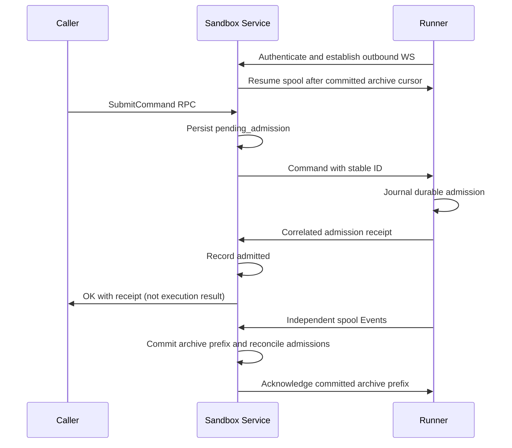

# Runner discovery and control-plane access implementation notes

Status: **implementation notes for [Sandbox Service](sandbox_service.md); source extraction is
implemented, live authority handoff remains gated.** Kubernetes already describes hosted sandboxes and their runner Pod
incarnations. Discovery belongs inside that backend; neither a separate directory service nor an
integration-app lookup API is required. The [dependency rule](../docs/service_boundaries.md) applies
from v1: notifications and other backends must operate without the integration app.

## Responsibilities

Keep three concepts separate:

- **Authority:** authenticated ServiceAccount/service/operator authority controls resource access.
  Workloads sharing an account have the same ordinary agent authority; no per-session caller identity.
- **Conversation:** an explicitly selected runner session, not a server-inferred app Thread.
- **Delivery binding:** an existing provisioned sandbox reference identifies where the session lives.
  Lookup resolves its current endpoint; it does not grant permission to control it.

[`SandboxInventory`](../sandbox_service/inventory.py) and endpoint resolution live inside Sandbox
Service, using neutral Kubernetes helpers. The app retains [`LiveIndex`](../app/live.py) and
[`SandboxSessions`](../app/threads/sessions.py) only to select explicit service destinations from
its UI projections. Do not import those app modules into the service. The app may still observe provisioning for presentation, but it is not the authoritative
endpoint/command path for other services. Product Thread annotations and UI projections stay app-owned.

## Internal lookup

The conceptual operation is `resolve_runner(destination_ref)`, returning the current runner endpoint
and configured ServiceAccount, temporary unavailability, or authoritative permanent removal. A lookup
failure is an error, not any of those lifecycle facts. This is an internal backend seam, not a new
network directory API. Final Python types/names are not prescribed here.

`destination_ref` names an existing provisioned sandbox with immutable UID and lookup coordinates,
not a directory-owned identity or caller-supplied URL. Normal Pod replacement retaining runner storage
changes the endpoint, not the destination. Name/IP reuse must not redirect subscriptions. Discarding
session storage needs an explicit generation/removal rule; matching names alone do not prove continuity.

The Sandbox Service can establish a self-delivery binding from an authenticated workload's Pod and
trusted provisioning associations. This is routing, not app Thread inference or a replacement for SA
access checks. Explicit destinations must also pass account/access validation. Notifications stores the
verified binding, not a guessed endpoint or an app Thread lookup result.

Session IDs are unique only within the runner's retained state. The proposed examples qualify them
with the destination reference. If choosing an SA-wide session ID instead, establish that uniqueness
contract and reject conflicting bindings; do not pick the first matching runner. Supply the necessary
IDs in backend-created agent context, not exclusively through app prompt construction.

Missing endpoints, watch failures, and timeouts are not permanent removal. Pin UID associations and
reject stale replacements. Limit the service's Kubernetes reads to its configured hosted inventory.
Session/removal and storage-generation rules remain concrete implementation details to settle.

## Existing runner access boundary

The checked-in app client uses `grpc.aio.insecure_channel` in [`RunnerClient`](../runner/client.py),
and the server uses `add_insecure_port` in [`service.py`](../runner/service.py). There is no bearer
metadata or application-level RPC identity verification on that path. The loopback default is not the
hosted bind: [`cluster/cdk8s/agentplane/app.py`](../../cluster/cdk8s/agentplane/app.py) starts the runner
on `0.0.0.0:7000`.

Cilium currently supplies the hosted network boundary: app egress permits runner Pods on TCP 7000,
and runner ingress permits Pods in the same namespace, not just the app. Other callers' reachability
also depends on egress and the union of applicable policies. These are source facts, not live enforcement
verification. Network reachability control is not cryptographic RPC authentication or TLS.

## V1: reuse network policy, move the control-plane caller

The extracted Sandbox Service becomes the runner client for migrated operations. App and notifications
use its authenticated/authorized API rather than retaining competing direct runner routes. Deferring
runner RPC authentication does not make the Sandbox Service API unauthenticated.

1. Permit Sandbox Service egress to hosted runner endpoints on TCP 7000.
2. Narrow runner ingress to intended control-plane clients and explicitly audited test/administrative
   callers. After a path is migrated, remove its obsolete app/notification direct access. Prefer
   namespace-qualified Cilium ServiceAccount identity selectors where supported, not labels ordinary
   sandbox workloads can assign themselves.
3. Audit overlapping policies: a new narrow rule does not undo a broad allow elsewhere. Test allowed
   and denied peers on both source egress and destination ingress.
4. Keep runner RPCs and attachment semantics unchanged. Trusted network-authorized clients retain
   full protocol/history access; no per-command RBAC or receipt-only runner stream is required.

Notifications sends its stable notice command through the Sandbox Service. That service opens the
existing runner session without a spec and relays observed Events; `Attached`, not an address lookup,
confirms current harness state. V1 must not implicitly create/resume a session. No app proxy, runner
callback, extra directory deployment, or per-session ticket issuer is required.

## TODO: proper runner authentication and transport security

**Deferred follow-up, not a notification-v1 prerequisite.** Add proper service-to-runner authentication
and transport security consistently for all legitimate runner clients, primarily the Sandbox Service
after extraction. Do not build a notification-specific credential system or confuse network policy
with RPC authentication. This supersedes requiring separate app/notification runner credentials.

Choose and test:

- Caller and runner peer identities over protected transport; mTLS or tokens over TLS are candidates,
  not selected mechanisms. JWT issuance is not part of v1.
- Provisioned trust/credentials, rotation/revocation, and expiry for long-lived attachments.
- Endpoint replacement, wrong-peer rejection, and stale-credential rejection.
- Shared client/server integration with network policy as an additional boundary. Fine-grained
  runner command RBAC remains outside the notification feature.

Until then, the documented boundary is Cilium-enforced access to the existing unauthenticated runner
RPC protocol. Do not claim this TODO is implemented because a connection test succeeds.

## Acceptance

- Extracted lookup/command paths work with the integration app unavailable and without app imports,
  private tables, API endpoints, browser state, or app-only session bootstrap.
- Sandbox Service can reach runners; ordinary sandbox Pods cannot reach other sandboxes' runners,
  nor can unrelated workloads or unneeded direct app/notification paths. Same-Pod loopback remains
  inside the agreed sandbox trust boundary. Exercise overlapping policies and both ingress/egress.
- Endpoint changes retaining state preserve command identity/receipt recovery; stale UID/name reuse
  and conflicting bindings are rejected. Lookup does not create a session or wake a stopped harness.
- Failures and temporary absence preserve subscriptions; permanent cleanup uses authoritative state.
- Notifications uses Sandbox Service for delivery/following, not a second provisioning/control loop.

## Outbound control-channel design

**Operator-supported direction; concrete protocol review remains open, not an implemented migration.**
The 2026-10-09 PDT discussion selects coordinated planning of durable command admission and runner
dial-out, with an authenticated long-lived WebSocket recommended. Claude RemoteIO inspires the
connection direction, not Agentplane's wire protocol, authorization or delivery guarantees.
[`RUNNER_TRANSPORT_DESIGN`](task_dag.md#runner_transport_design--runner-dial-out-and-connection-lifecycle)
resolves framing/versioning, bootstrap authentication, ownership/fencing and replay/backpressure
before implementation. Validate WS support on the actual proxy path; revisit bidirectional gRPC
only for a concrete transport constraint, not a new generic messaging platform.

Receipts and spool Events may race; the diagram is illustrative, not a required cross-stream order.
Command insertion and spool listening are independent logical operations on this connection, not
reverse unary gRPC calls. Neither creates a Session or resumes a stopped harness. Define lifecycle
message mappings separately. A replay cursor is not part of command submission identity.

### Coordinated implementation and rollout

The [admission plan](command_admission.md) owns persistence/retry semantics. Implement its core
against a transport interface while implementing both channel peers against the reviewed contract.
Do not require an intermediate inbound `InsertCommand`/`ListenSpool` migration or couple submission
to `Attach` history replay. Retain useful runner admission/receipt internals and tests from prototypes.

Deploy compatible service channel support first with existing routes unchanged, then a compatible
runner image in a fresh outbound-enabled canary (`RUNNER_OUTBOUND_CANARY`). Verify the actual proxy
path, authentication, reconnect, ownership/fencing and replay. Then integrate the public durable
submission handler and independent archive ingestion (`SESSION_COMMAND_SUBMISSION`); both must pass
before `RUNNER_OUTBOUND_ROLLOUT` expands to selected existing environments. This is not an atomic
fleet deployment and does not require first moving every runner.

One explicit route owns each environment/incarnation. Do not silently fall back per request or
blindly resend ambiguous commands through an old route. Rollback preserves pending submissions,
command IDs, journal/history and exclusive route ownership. Remove legacy command submission and
inbound access only when all relevant consumers, including lifecycle callers, have moved.

Draft code and isolated tests may proceed during backfill. This specific permission does not lift
merge/schema-application/deployment gates on archive ownership and compatibility verification, or
unrelated VM/service-change holds. No notification metadata, background dispatch or automatic wake
is part of the initial admission/channel rollout.

### Authority is separate from connection direction

The runner can dial out while keeping SQLite command admission and ordered Events. Sandbox Service
continues authorizing commands and copying execution evidence; it does not infer command success
from channel writes, heartbeat replies or stream acknowledgements. Durable service input metadata
also does not imply offline command acceptance. Moving admission centrally/removing the journal and
native offline catch-up stay separate, deferred decisions.

Specify how the channel authenticates the expected runner/environment and current incarnation using
trusted provisioning associations. Names, IPs, claimed session IDs and guest-supplied labels are not
proof. Review bootstrap/credential rotation and whether shared workload credentials sufficiently
distinguish the runner from harness-launched processes for the intended trust boundary; do not claim
process isolation from ServiceAccount authentication alone. Keep long-lived/provider credentials
outside the VM guest. Caller authorization remains at the service API regardless of channel owner.

### Connection ownership, heartbeat and liveness

Decide how a channel maps to a Sandbox/VM UID, runner incarnation and hosted sessions, and how an API
request reaching another Sandbox Service replica finds the active owner. Compare a small owner/lease
record plus replica forwarding with other justified routing choices; do not invent a new broker or
process-local singleton as a requirement. Fence superseded connections so a late old stream cannot
accept controls as the current runner. A transport connection epoch is not a new Session/Event ID.

Define bounded heartbeat/lease timing, who sends/observes it, freshness and explicit status exposed
to callers. Distinguish connected/recently seen from ready to accept controls, and both from harness
turn progress. Missing heartbeats mean unavailable/stale observation, not proof the process died,
the harness stopped, a turn completed or a command failed. Define reauthorization and revocation
on reconnect/credential expiry. Neither a missed heartbeat nor a new stream silently restarts work.

### Reconnect, replay and flow control

Keep stable command IDs and original payloads across ambiguous sends; reconcile from the runner's
receipts rather than replay side effects. Define stream acknowledgement versus durable command
admission and durable archive cursor separately. Replay Events from the committed prefix with exact
duplicate/conflict handling; multiple service replicas must not acknowledge data only held in a
lost owner's memory. Decide what happens while disconnected without claiming a new offline queue.

Bound inflight commands/Event batches, replay buffers and slow-reader pressure. State whether and
how control traffic avoids starvation during large history catch-up, and define deadlines/cancel
behavior without interpreting transport cancellation as harness cancellation. Heartbeats alone do
not prove that either direction is making application progress.

### VM sequencing and bounded validation

Before `VM_CONTROL_NETWORKING`, finalize the outbound control design and state which guest ports,
endpoint discovery and network policies it replaces. Outbound control may simplify VM reachability,
but guest access to LLM/Action APIs still needs its authorized relay. Image/resource-isolation work
can proceed independently; service/persistence merge and deployment honor the archive-migration hold.

Implement `RUNNER_OUTBOUND_CHANNEL` after concrete protocol review with automated peer tests for authentication denial,
ordinary disconnect/reconnect, stale-owner fencing, replay, token expiry and backpressure. Perform
a bounded real-VM connection/reconnect/receipt check for the actual proxy/network path; do not require
simultaneous node/database/guest failure drills. `RUNNER_OUTBOUND_ROLLOUT` then handles selected
existing environments with explicit route mode, a compatible image transition and rollback; never
leave two uncontrolled command paths. A fleet rollout is not automatically a gate on first VM use.
