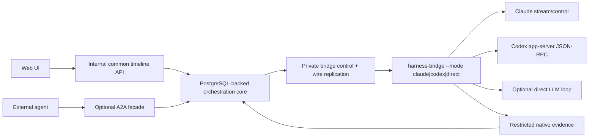

# A2A fit and protocol layering

Status: **design decision with a validation spike required**. This evaluates the A2A 1.0 line at
A2A repository commit
[`c0f30b35`](https://github.com/a2aproject/A2A/tree/c0f30b35390c59d2cc398a1100823a9115b97a20)
(latest GitHub release `v1.0.1` on 2026-05-28).

## Decision

A2A is not the harness-neutral control protocol and is not the API used by the web UI to inspect an
agent's internal rollout. It is an optional later facade for one agent to delegate work to another
agent as an opaque peer.

The product keeps two private/internal surfaces:

- the bridge control/replication protocol for attempts, dispatch, native frames, and recovery;
- the common harness timeline for the web UI and orchestration logic, including messages,
  operations, steering, interrupts, and provider provenance.

An A2A facade may project a deliberately smaller view of that state: task input, working/terminal
status, useful messages and artifacts, cancellation, and follow-up context. It does not need to
expose shell commands, tool arguments, raw frames, compaction, or native session internals.

This layering follows A2A's design instead of extending against it. A2A explicitly assumes that
agents can collaborate without access to each other's internal state, memory, or tools.

## What A2A supplies

A2A has strong matches for the external delegation boundary:

| Harness Control Plane    | A2A 1.0 concept                |
| ------------------------ | ------------------------------ |
| Agent conversation scope | `context_id`                   |
| Delegated unit of work   | `Task`                         |
| Caller/agent content     | `Message` with typed `Part`s   |
| Working/terminal status  | `TaskStatusUpdateEvent`        |
| Deliverable output       | `Artifact` / artifact updates  |
| Long-running response    | streaming message operation    |
| Later follow-up          | another message in the context |
| Cancellation             | task cancellation              |

The normative model supports text, files, URLs, arbitrary structured JSON in `Part`, task and
artifact metadata, streaming updates, multiple bindings, and declared extensions. Those are enough
for a useful opaque coding-agent service without turning A2A into a process debugger.

Relevant pinned sources:

- [A2A goals and opaque-execution principle](https://github.com/a2aproject/A2A/blob/c0f30b35390c59d2cc398a1100823a9115b97a20/docs/specification.md#L13-L41)
- [`Task`, `Message`, `Part`, and `Artifact`](https://github.com/a2aproject/A2A/blob/c0f30b35390c59d2cc398a1100823a9115b97a20/specification/a2a.proto#L167-L293)
- [streaming task status and artifact updates](https://github.com/a2aproject/A2A/blob/c0f30b35390c59d2cc398a1100823a9115b97a20/specification/a2a.proto#L296-L321)

## Why operation progress remains internal

A2A's standard stream contains tasks, messages, task-status updates, and artifact updates. It does
not define a standard lifecycle for tool input, streamed tool output, structured result, and native
provenance. That omission is consistent with its opaque-agent boundary.

A wrapper can put tool progress in `WORKING` messages, structured parts, artifacts, or extensions.
That can be useful for a trusted bilateral integration, but it should not drive the core Harness
Control Plane model. The internal common protocol still needs exact operation records because its
own UI and recovery logic are explicitly inspecting the harness.

The first A2A facade therefore exposes:

- coarse submitted/working/completed/failed/canceled state;
- agent-authored progress messages when useful;
- final text, diffs, reports, and other deliverable artifacts;
- input-required status only when the delegated task genuinely needs more caller input.

It does not standardize native tool frames as A2A progress. A future optional extension is possible,
but is not part of the v0 design or a prerequisite for A2A interoperability.

## What A2A does not replace

A2A does not define the private semantics needed to recover one supervised harness safely:

- central input commit versus bridge durability versus native admission;
- attempt generation/fencing and stale-writer rejection;
- bridge-log sequence/ack exchange;
- native process generation inside a surviving Pod;
- exact native-frame storage and replay;
- Kubernetes Sandbox/PVC lifecycle;
- provider-native session start/resume and its compatibility profile;
- uncertain dispatch after a crash near side effects.

These remain in the private bridge protocol and PostgreSQL schema. The A2A facade projects proven
outcomes and honest high-level uncertainty; it does not become their source of truth.

## Existing wrapper evidence

[`a2acode`](https://github.com/kanywst/a2acode/tree/12b4b20cf8a1f6f129704b5580a1da4176bb5072)
is the most relevant existing implementation found in the preflight. It serves coding agents over
A2A 1.0, maps assistant text/reasoning/plan/diffs into artifacts, maps tool starts/outcomes into
working status messages, and uses A2A context ids for continuity. It is Apache-2.0 and has an offline
echo backend that can exercise the A2A path.

It is useful as:

- evidence that a coding agent can be exposed as an A2A peer;
- a reference for task/context/artifact mappings and interoperability fixtures;
- a possible source of reusable A2A server/client code.

It is not the harness supervisor for this architecture. Its Claude paths use ACP or the Claude Agent
SDK. The Agent SDK itself launches the Claude Code binary, so this is not a different underlying
agent loop; the relevant difference is that `a2acode` does not expose or own the exact CLI
stream/control profile and recovery evidence required by this design. It also does not supply our
Kubernetes attempt fencing, bridge log, native-frame provenance, or crash-window recovery model.
Those differences require native bridge adapters even if an external caller uses A2A.

## Proposed layering

The web UI gets the rich internal timeline. External agents get an opaque A2A task surface. The
orchestration core keeps a private mapping from A2A `context_id`/`task_id` to Thread/Turn identity;
the identifiers are not shared or exported. Outbound A2A messages, artifacts, task metadata, and
status contain no bridge or common-protocol ids.

## Validation spike before commitment

A short offline spike should answer:

1. Can an A2A 1.0 server/client round-trip one delegated coding task with text, deliverable file/diff
   artifacts, terminal status, cancellation, and follow-up context?
2. Does one durable Thread map internally to one opaque A2A context with one Task per delegated
   turn, without exporting private ids?
3. Can internal recovery uncertainty be represented honestly without exposing bridge internals?
4. Can `a2acode`'s offline backend or SDK tests be reused as interoperability fixtures?
5. Can the facade remain useful when it omits internal tool and raw-frame events entirely?

If yes, A2A is a good optional agent-to-agent facade. If not, defer it; neither the bridge protocol
nor the internal common timeline depends on the result.
