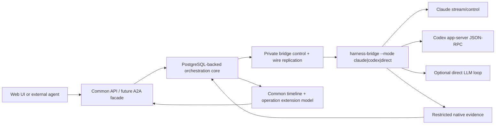

# A2A fit and protocol layering

Status: **design decision with a validation spike required**. This evaluates the A2A 1.0 line at
A2A repository commit
[`c0f30b35`](https://github.com/a2aproject/A2A/tree/c0f30b35390c59d2cc398a1100823a9115b97a20)
(latest GitHub release `v1.0.1` on 2026-05-28).

## Decision

Do not use A2A as the private bridge-to-server control/replication protocol in the first
implementation. That seam must carry attempt fencing, dispatch admission, native process
generations, bridge-WAL cursors, raw-frame provenance, and recovery evidence. A2A deliberately
models collaboration between independently operated, potentially opaque agents rather than control
of one supervised harness process.

Do shape the common product model so it projects cleanly to A2A, and implement an A2A facade after
the Claude and Codex vertical slices are working. If a small coding-operation extension proves
sufficient, the facade can become the public harness-neutral agent interface without making A2A the
internal recovery protocol.

This avoids both bad extremes:

- inventing an unrelated public agent protocol before testing an existing standard; and
- forcing private orchestration evidence into A2A fields that were not designed to carry it.

## What A2A already supplies

A2A has strong matches for the user-facing half of this design:

| Harness Control Plane | A2A 1.0 concept                     |
| --------------------- | ----------------------------------- |
| Thread                | `context_id`                        |
| Turn                  | `Task`                              |
| User/assistant input  | `Message` with typed `Part`s        |
| Turn status           | `TaskStatusUpdateEvent`             |
| Streamed output/diff  | `TaskArtifactUpdateEvent`           |
| Completed output      | `Artifact`                          |
| Long-running stream   | streaming message operation         |
| Later follow-up       | another message in the context      |
| Cancellation          | task cancellation                   |
| Provider extension    | `AgentExtension` plus extension ids |

The normative model supports text, files, URLs, and arbitrary structured JSON in `Part`; task and
artifact metadata; streaming status/artifact updates; multiple protocol bindings; and declared
extensions. Those are useful building blocks rather than a superficial text-only API.

Relevant pinned sources:

- [A2A goals and opaque-execution principle](https://github.com/a2aproject/A2A/blob/c0f30b35390c59d2cc398a1100823a9115b97a20/docs/specification.md#L13-L41)
- [`Task`, `Message`, `Part`, and `Artifact`](https://github.com/a2aproject/A2A/blob/c0f30b35390c59d2cc398a1100823a9115b97a20/specification/a2a.proto#L167-L293)
- [streaming task status and artifact updates](https://github.com/a2aproject/A2A/blob/c0f30b35390c59d2cc398a1100823a9115b97a20/specification/a2a.proto#L296-L321)
- [declared protocol extensions](https://github.com/a2aproject/A2A/blob/c0f30b35390c59d2cc398a1100823a9115b97a20/specification/a2a.proto#L411-L432)

## The missing standard concept: operation progress

A2A's standard streaming union contains tasks, messages, task-status updates, and artifact updates.
It does not define a common operation/tool-call lifecycle with stable operation id, structured
input, streamed output, structured result, and native provenance.

A wrapper can encode operation progress today in several conforming ways:

- a `WORKING` task-status update whose message contains a structured `Part.data`;
- an artifact dedicated to operation records;
- extension metadata on a message or artifact.

Those are wire-compatible but not semantically interoperable unless callers agree on an extension.
The first candidate extension needs only the intersection already defined in
[the common protocol](common_protocol.md):

```json
{
  "operation_id": "op_...",
  "kind": "shell | file.read | file.write | file.patch | search | tool | generic",
  "phase": "started | output | completed | failed | interrupted | unknown",
  "name": "...",
  "input": {},
  "output": {},
  "error": null,
  "native_provenance": {
    "provider": "claude | codex",
    "attempt_id": "att_...",
    "native_process_generation": 1,
    "first_native_seq": 10,
    "last_native_seq": 14
  }
}
```

The extension should use A2A's normal task stream, not create another public streaming transport.
Raw native frames remain on the restricted diagnostic surface; sending every delta as an A2A
artifact would be noisy and would expose an internal implementation detail as the public contract.

## What A2A does not replace

A2A does not define the private semantics needed to recover one supervised harness safely:

- central input commit versus bridge durability versus native admission;
- attempt generation/fencing and stale-writer rejection;
- bridge WAL sequence/ack exchange;
- native process generation inside a surviving Pod;
- exact native-frame storage and replay;
- Kubernetes Sandbox/PVC lifecycle;
- provider-native session start/resume and its compatibility profile;
- uncertain dispatch after a crash near side effects.

These remain in the private bridge protocol and PostgreSQL schema. The A2A facade projects proven
common events and honest uncertainty states; it does not become their source of truth.

## Existing wrapper evidence

[`a2acode`](https://github.com/kanywst/a2acode/tree/12b4b20cf8a1f6f129704b5580a1da4176bb5072)
is the most relevant existing implementation found in the preflight. It serves coding agents over
A2A 1.0, maps assistant text/reasoning/plan/diffs into artifacts, maps tool starts/outcomes into
working status updates, and uses A2A context ids for session continuity. It is Apache-2.0 and has an
offline echo backend that can exercise the A2A path.

It is useful as:

- evidence that A2A can carry a coding-agent rollout without flattening everything to final text;
- a reference mapping and interoperability fixture;
- a possible source of reusable A2A server/client code.

It is not a drop-in answer for this architecture. Its Claude paths use ACP or the Claude Agent SDK,
not the native Claude CLI subscription-compatible path required here. The product must retain
Claude's stream/control evidence, supervise
it inside an Agent Sandbox, and recover through the central attempt/WAL model. Its persisted A2A
tasks also do not preserve a live native process across server restart. Those differences require a
native bridge adapter even if the northbound API is A2A.

Other small Claude/Codex A2A wrappers exist, but no inspected project supplied the full combination
of native subscription harness, Claude+Codex exact protocol provenance, Kubernetes suspension,
central fencing, and crash-window experiments.

## Proposed layering



The common model is written once. Native adapters map into it. The ordinary web UI consumes it
directly. An A2A facade maps the same Thread/Turn/Message/Artifact lifecycle onto A2A and adds the
small operation-progress extension when negotiated.

## Validation spike before commitment

A short spike should answer:

1. Can an A2A 1.0 server/client round-trip one common turn with text, shell progress, file diff,
   terminal status, and follow-up context without losing ids?
2. Can the proposed operation record be represented as `Part.data` on status messages or artifacts
   without fighting SDK behavior?
3. Can a caller that does not understand the extension still receive useful text/artifacts and task
   status?
4. Can a2acode's offline backend or SDK tests be reused as interoperability fixtures?
5. Does A2A task cancellation map cleanly to the common interrupt request/outcome distinction?
6. Does one common Thread with several provider turns map more naturally to one A2A context with one
   Task per turn, as proposed?

If the answers are yes, expose A2A rather than inventing another public wire protocol. If the
operation extension proves awkward or A2A task semantics conflict with durable-thread behavior,
keep the common API private and revisit with evidence. In either case, the internal bridge protocol
remains separate.
