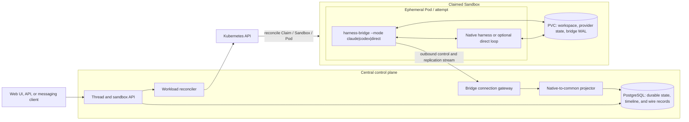

# Architecture and sandbox lifecycle

Status: **proposal**. This is a new product design, not a description of the current Haku Console
implementation. See the [document index](README.md).

## Problem

Coding-agent products need to start, observe, steer, interrupt, suspend, resume, replace, and debug
native harnesses such as Claude Code and Codex. A terminal multiplexer is useful for a human, but it
is a poor machine integration boundary.

[Gas Town's provider integration guide](https://github.com/gastownhall/gastown/blob/main/docs/agent-provider-integration.md)
describes a zero-integration path based on launching a harness in tmux, using `send-keys`, guessing
readiness from a pane or delay, and reading output with `capture-pane`. The guide correctly calls
out the result: timing sensitivity and no delivery confirmation. Gas City adds provider and
Kubernetes abstractions around this, but a tmux backend still cannot prove which turn accepted an
input or which structured operation produced output.

This design uses a different boundary: **run each native harness in a Kubernetes workload and speak
its machine protocol**. Claude Code is driven through its structured stream/control interface.
Codex is driven through app-server JSON-RPC. Terminal access remains a diagnostic escape hatch, not
the correctness mechanism.

## Goals

- Run each live harness attempt in a bounded Pod or sandbox-backed workload.
- Let a central server own durable thread identity, accepted input, workload desired state,
  recovery decisions, normalized rollout history, and user-visible status.
- Put one small `harness-bridge` binary in each workload. Provider modes launch and supervise
  Claude Code, Codex, or an optional direct-LLM loop behind the same central protocol.
- Preserve native Claude Code and Codex behavior as the default path. A direct-LLM loop is an
  explicit alternative, not the baseline implementation.
- Retain native traffic evidence as provenance while presenting common conversation and operation
  concepts in the UI.
- Make central-server failure, bridge failure, harness-process failure, Pod loss, and intentional
  suspension separate and observable recovery cases.
- Keep a suspended sandbox's PVC-backed workspace without paying for a running Pod.
- Promote recovery behavior to a product guarantee only after pinned, rerunnable provider
  experiments prove it.

## Non-goals

- No generic workflow DSL, issue tracker, merge queue, or multi-agent role system.
- No requirement that every provider feature collapse into one lowest-common-denominator API.
- No promise that an in-flight provider turn can continue after process or Pod death. That is an
  experiment question, not an assumption.
- No process hibernation claim for Kubernetes suspension. Ordinary suspension deletes the Pod.
- No pane scraping, prompt detection, PTY timing, or `kubectl exec` in the production control path.
- No single permanent Kubernetes backend. Agent Sandbox is the preferred first backend, behind a
  narrow provisioning interface that can also support plain Pods.

## Architectural vocabulary

- **Thread**: durable user-facing conversation identity. It survives workload replacement.
- **Sandbox record**: durable environment identity, desired operating mode, provider, PVC policy,
  and current Kubernetes references.
- **Attempt**: one bridge/Pod incarnation. A thread can have many attempts over time.
- **Native process generation**: one child harness process within an attempt. Restarting the child
  increments this generation without pretending the Pod or bridge changed.
- **Native session**: the provider's resumable conversation identity, for example a Claude session
  id or Codex thread id. It is scoped to a provider and exact compatibility regime.
- **Turn**: one provider execution bracket with one initiating input and zero or more steering
  inputs. Every input remains independently identified and admitted.
- **Wire record**: one exact line/message on the native protocol, plus direction and ordering
  metadata.
- **Timeline event**: a durable common projection used by clients. It points back to one or more
  wire records.

Kubernetes object names, Pod UIDs, bridge connection ids, provider session ids, and durable thread
ids are deliberately different identifiers.

## Topology



The central boxes are logical roles. The first implementation uses one replicated service and
PostgreSQL. Metadata, accepted input, lifecycle, common events, and compressed wire-record segments
all live in Postgres. The database, not one server process, is the continuity authority. Another
storage system requires a demonstrated reason; it is not an open design choice.

## Major decisions

### One attempt per Pod; one thread across attempts

A live attempt gets its own process tree, resource limits, and Pod identity. The thread and sandbox
record do not disappear when that Pod does. Replacing a failed attempt is a state transition on the
same durable thread and, when storage survives, the same sandbox.

One live attempt may serve several turns while active. “One attempt per Pod” does not mean one Pod
per prompt.

### The bridge is the workload entrypoint and child supervisor

One `harness-bridge` executable launches the selected provider mode as its child, owns stdin/stdout
or the local socket, performs the native handshake, emits health, and terminates the whole process
group on shutdown. Provider-specific behavior is selected by configuration, not by deploying a
different control-plane binary. This avoids PID discovery, competing readers, and sidecars racing
to attach to process-local pipes.

The bridge has provider adapters but is not the authority for threads, scheduling, or final
user-visible outcomes. It may keep a bounded write-ahead log on the PVC so a server outage does not
force unbounded RAM buffering.

### The bridge dials outward

The bridge opens an outbound stream to the central gateway. The server does not need per-Pod
ingress, PTY attachment, or `kubectl exec`. On reconnect the bridge announces:

- attempt and sandbox identity;
- the persisted attempt generation/fencing token;
- provider, native version, bridge version, and compatibility profile;
- native process generation, child identity, and current local state;
- last server command durably accepted;
- highest wire sequence durably retained and highest server acknowledgement observed;
- native session and active-turn identifiers, when known.

The server answers with the durable cursor and desired attempt state. Only the current persisted
attempt generation may admit input or append authoritative acknowledgements. A stale partitioned
bridge can reconnect for diagnostics, but its writes are fenced. Replacement waits for confirmed
old-workload termination before it opens a provider-native session for writing. Both sides tolerate
duplicate transport delivery; semantic replay of provider input remains conservative.

### The server commits input before dispatch

The server assigns stable ids and commits accepted input before sending it to an attempt. Dispatch
progress is an explicit state machine, not a boolean:

`accepted -> offered -> bridge_durable -> native_admitted -> terminal`

A disconnect in `accepted` is safe to retry. A disconnect after `native_admitted` may have produced
side effects and must not be replayed automatically unless the provider exposes an operation id or
resume contract that proves replay safe. “Outcome uncertain” is a valid terminal operator state.

### Native protocols are authoritative at the workload edge

Provider adapters own initialization, prompt submission, steering, interruption, resumption, event
interpretation, and native terminal-state detection. The common protocol is a projection for
storage, control, and UI; raw native fields remain available and provider-specific features can pass
through without inventing fake equivalence. See [provider adapters](provider_protocols.md) and the
[common vocabulary](common_protocol.md). Its relationship to A2A 1.0 is evaluated separately in
[A2A fit and protocol layering](a2a.md).

### Persistent state is explicit

The container root filesystem is disposable. The PVC contains only deliberate continuity material:

```text
/workspace/project/               checked-out project and generated artifacts
/workspace/.harness/claude/       Claude native state selected for persistence
/workspace/.harness/codex/        CODEX_HOME / rollout state selected for persistence
/workspace/.bridge/               attempt manifest and bounded unacked wire-log WAL
```

Exact paths are image configuration, not protocol. Provider state and workspace can be separate
PVCs later if their retention or backup needs diverge.

PostgreSQL retains identities, lifecycle, accepted input, normalized timeline, compressed wire
records, and proven/uncertain outcomes. Large frame streams use partitioned append-only tables and
compressed `bytea`/JSON payloads.

### Native harnesses are the default; a direct agent loop is an option

The first release supports Claude Code and Codex as native harnesses. That path is required for
Claude subscription-compatible use and avoids rebuilding provider machinery that already exists in
the harness: context compaction, tool-output overflow handling, native session history, steering,
interrupts, provider-specific tools, and upgrade compatibility.

The same bridge binary may later run `--mode direct` against an LLM API. That mode would implement
the agent loop itself and emit the same common inputs, turns, messages, operations, and terminal
events as the native adapters. It is useful when a provider has no suitable harness, when exact loop
behavior matters more than native features, or when API-only deployment is intentional.

The direct mode carries a substantially larger implementation obligation: model streaming,
tool-call assembly, overflow/spill behavior, context and compaction, retries, cancellation,
continuation after partial output, and durable model-facing history. It therefore starts as an
optional third adapter after the Claude and Codex intersections are proven, not as the abstraction
from which those adapters are derived.

## Agent Sandbox lifecycle

The preferred first backend is Kubernetes SIGs Agent Sandbox. Ducktape currently pins
[agent-sandbox v0.5.5](https://github.com/kubernetes-sigs/agent-sandbox/releases/tag/v0.5.5)
(commit [`3ea199b8`](https://github.com/kubernetes-sigs/agent-sandbox/tree/3ea199b8b910f8e838a6000796c29536d592fbdd)).
The current Claude/Codex templates mount one 10 GiB PVC at `/workspace`, and the current Codex warm
pool keeps one spare Sandbox. The product's claimed-sandbox suspension requirement is therefore
new behavior to exercise, not a claim that the existing warm pool is configured to scale to zero.
The design must pin and test the deployed controller rather than infer behavior from a moving
upstream branch.

The relevant ownership shape is:

```text
SandboxClaim -> Sandbox -> Pod, PVC, optional Service
```

A claim may adopt a warm-pool Sandbox, in which case the Sandbox keeps its pool-generated name, or
cold-create one. The control plane therefore stores both Claim identity and the resolved Sandbox
name/UID; it never derives one from the other.

### Suspension is compute-off, not process freeze

For v0.5.5, setting `Sandbox.spec.operatingMode: Suspended` gracefully deletes the Pod while
retaining the Sandbox CR, PVCs, and requested Service. `Suspended=True` is reported only after the
Pod is gone. Setting the mode back to the running state creates a new Pod wired to the same
Sandbox-owned PVC. This is the pinned
[suspend/resume contract](https://github.com/kubernetes-sigs/agent-sandbox/blob/3ea199b8b910f8e838a6000796c29536d592fbdd/docs/keps/694-kep-for-suspend-and-resume-for-beta/README.md#L117-L129),
implemented by the controller's
[Pod-deletion path](https://github.com/kubernetes-sigs/agent-sandbox/blob/3ea199b8b910f8e838a6000796c29536d592fbdd/controllers/sandbox_controller.go#L1075-L1105).

Consequences:

- `/workspace` survives when correctly mounted from the PVC.
- Process memory, PIDs, tmux sessions, open sockets, Pod IP, and writes outside persistent mounts do
  not survive.
- The Sandbox name/UID and PVC identity remain stable across ordinary suspend/resume and Pod
  recreation because PVCs are reconciled independently and the recreated Pod references the same
  [Sandbox-owned claim names](https://github.com/kubernetes-sigs/agent-sandbox/blob/3ea199b8b910f8e838a6000796c29536d592fbdd/controllers/sandbox_controller.go#L1284-L1313).
  The Pod UID and processes are new.
- Deleting the **Sandbox CR** is different: garbage collection removes its owned PVC. A replacement
  Sandbox is a fresh environment even if a Kubernetes name is reused.
- Scaling a **WarmPool** to zero destroys unused pool-owned Sandboxes and their PVCs through
  [Sandbox deletion](https://github.com/kubernetes-sigs/agent-sandbox/blob/3ea199b8b910f8e838a6000796c29536d592fbdd/extensions/controllers/sandboxwarmpool_controller.go#L676-L733).
  It does not suspend claimed environments.

These are controller semantics, not yet an end-to-end product guarantee. The experiment suite must
still prove storage class behavior, mount contents, native state paths, and exact image pins in the
target cluster.

### Product sandbox states

```mermaid
stateDiagram-v2
    [*] --> Allocating
    Allocating --> Active: Pod ready + bridge/native handshake
    Allocating --> Failed: allocation or bootstrap failure

    Active --> Suspending: idle policy or operator request
    Suspending --> Suspended: Pod absent; Sandbox + PVC retained
    Suspended --> Resuming: new input or operator request
    Resuming --> Active: new Pod + native resume/new attempt

    Active --> Recovering: bridge, harness, or Pod lost
    Recovering --> Active: replacement attempt reconciled
    Recovering --> NeedsAttention: continuity or dispatch uncertain

    Active --> Failed: unrecoverable attempt failure
    Failed --> Recovering: retry requested
    NeedsAttention --> Recovering: operator chooses recovery

    Suspended --> Disposing: explicit disposal or retention expiry
    Active --> Disposing: explicit disposal or retention expiry
    Failed --> Disposing: explicit disposal or retention expiry
    Disposing --> Disposed: Claim/Sandbox/PVC deleted
    Disposed --> [*]
```



`Suspended` remains visible in the product. It is not deletion and not “offline unknown.” `Disposed`
is an explicit destructive lifecycle transition with separately configured retention.

### Suspend policy

The default automatic suspension path is:

1. stop admitting new turns;
2. require the attempt to be idle;
3. flush native records and bridge WAL through a durable acknowledgement;
4. record native session id and compatibility metadata;
5. terminate the child cleanly within a deadline;
6. set the Sandbox to `Suspended`;
7. wait for the controller's suspended condition and Pod absence;
8. mark the product sandbox `Suspended`.

Forced suspension of an active turn first requests native interruption and waits for a terminal
provider observation. If the deadline expires, the attempt is marked `outcome_uncertain` before the
Pod is removed. The control plane never represents Pod deletion as a clean interrupt merely because
it requested one.

Resume reverses compute state, not process state: create the Pod, start a new attempt, verify the
PVC, perform the provider handshake, and then either resume the native session or start a new native
session with an explicit continuity break.

## Nominal lifecycle

```mermaid
sequenceDiagram
    participant U as User
    participant S as Central server
    participant D as Central durable stores
    participant K as Kubernetes
    participant B as harness-bridge + PVC WAL
    participant H as Native harness

    U->>S: Submit input to durable thread
    S->>D: Commit input + stable ids
    S->>K: Ensure claimed Sandbox is running
    K-->>B: Start Pod and mount PVC
    B->>H: Launch + native initialize/resume
    B->>S: Authenticate; announce attempt and cursors
    S->>B: Offer committed input
    B->>B: Persist local acceptance in PVC WAL
    B-->>S: bridge_durable acknowledgement
    B->>H: Native prompt / turn request
    H-->>B: Native admission id / event
    B-->>S: native_admitted evidence
    H-->>B: Stream native records
    B-->>S: Forward sequenced records
    S->>D: Append wire log + project timeline
    S-->>U: Stream common rollout with raw-frame drill-down
    H-->>B: Native terminal event
    B-->>S: Terminal evidence
    S->>D: Commit proven outcome
```

The bridge WAL in the diagram is local to the workload; it is not a substitute for the central
input commit or timeline.

## Recovery cases

### Central-server replica or connection failure

The harness and bridge may continue while the server is unavailable. The bridge appends wire
records to a bounded PVC WAL. After a new server replica accepts the outbound reconnect, both sides
exchange cursors, the bridge retransmits missing records, and the server deduplicates by attempt and
wire sequence.

If the WAL reaches its configured bound, the bridge does not silently discard required evidence. It
must either backpressure the native reader when safe, continue with an explicit `evidence_gap`
marker, or interrupt the turn. Which providers tolerate read backpressure is an experiment result.

### Harness child process failure while the Pod survives

The bridge records exit code/signal, stderr tail, last wire position, native session id, and active
turn id. It must not assume the active turn failed before side effects. Recovery starts a new child
inside the same Pod with an incremented `native_process_generation`, or starts a replacement
attempt. Native resume is used only if the compatibility suite has proven the exact case.

Process supervision APIs can detach and reattach while the containing Pod survives, but cannot keep
a PID alive after that Pod is deleted.

### Bridge process failure

Because the bridge is PID 1/entrypoint, its failure fails the attempt and normally the Pod. The
server observes both connection loss and Kubernetes state. A replacement Pod reuses the PVC and
reconciles the bridge WAL before dispatching more input.

### Pod loss while Sandbox and PVC survive

The controller recreates a new Pod against the same PVC. The server creates a new attempt id,
verifies the Sandbox UID and PVC sentinel, starts the native harness, and attempts provider-native
resume. Workspace persistence and conversation resumption are separate assertions: one may work
while the other does not.

### Sandbox CR or PVC loss

This is environment loss, not ordinary attempt recovery. The control plane opens a new Sandbox,
marks the previous workspace unavailable, and requires an explicit restoration path from Git or
backup. It must not claim native continuity from a coincidentally reused name.

### Uncertain dispatch

If a provider may have admitted a turn but terminal evidence is absent, the UI shows the accepted
input, last proven provider event, known workspace facts, and an uncertain outcome. Recovery choices
are explicit: inspect, resume provider session, start a new follow-up without automatically
redispatching the original input, or abandon the turn. A follow-up can still cause new side effects;
it is not presented as a safety guarantee. Blindly resending the original prompt is not the default.

## Recovery matrix

| Failure                    | What survives                         | Automatic action                             | Required visible caveat                       |
| -------------------------- | ------------------------------------- | -------------------------------------------- | --------------------------------------------- |
| Central replica restart    | Pod, bridge, harness, PVC, local WAL  | Reconnect and replay wire gap                | Show reconnect only if it delays output       |
| Bridge-server network loss | Child and PVC                         | Buffer bounded records, reconnect            | Evidence gap/backpressure if buffer overflows |
| Harness process exits idle | Pod and PVC                           | Restart child; native resume if proven       | New native process generation                 |
| Harness exits mid-turn     | PVC; perhaps provider history         | Resume or replace only per experiment result | Turn may be interrupted or uncertain          |
| Bridge/Pod dies            | Sandbox and PVC                       | Recreate Pod and attempt                     | Process memory is gone                        |
| Intentional suspend        | Sandbox, PVC, central history         | Delete Pod; later create new attempt         | Resume is cold process start                  |
| Sandbox CR deleted         | Central history only unless backed up | Allocate fresh environment                   | Workspace/provider state lost                 |
| PVC unavailable/corrupt    | Central history and wire records      | Stop; restoration workflow                   | No false continuity claim                     |

## Web UI

### Sandbox inventory

The primary inventory lists durable sandbox records, not only running Pods. It uses two independent
axes:

- **Sandbox lifecycle**: allocating, active, suspending, suspended, resuming, failed, disposing,
  disposed.
- **Attempt/turn activity**: idle, starting, working, steering, interrupting, recovering, uncertain.

Default groups are derived from those axes:

- **Active**: a Pod is expected or present; activity shows whether it is idle, working, or
  recovering.
- **Suspended**: Pod absent by policy; PVC retained; last native session and last activity shown.
- **Needs attention**: failed, evidence gap, uncertain turn, storage mismatch, or recovery blocked.
- **Disposed**: hidden by default but retained as audit metadata for the configured period.

Each row shows provider/version, thread, desired/observed mode, Claim and resolved Sandbox identity,
Pod age when present, workspace/PVC status, active turn, last durable event, and available actions.
The UI must not render a suspended sandbox as a failed Pod.

### Conversation rollout

The thread page renders the common timeline as a conversation:

- accepted user prompts;
- assistant messages and readable reasoning summaries;
- operation cards for shell, file changes, and generic tool/provider operations;
- interrupt/steer inputs and whether they were admitted;
- attempt, reconnect, suspension, resume, and uncertainty markers.

A “native frames” toggle interleaves restricted raw evidence or redacted/coalesced provider records
at their exact timeline anchors. Drill-down shows direction, native sequence range, provider ids,
evidence tier, projection version, and whether the frame was live, replayed, or recovered from the
bridge WAL. Provider detail never changes the ordering of the common rollout.

### Raw-frame retention and coalescing

Every native input/output record receives a sequence within `(attempt_id,
native_process_generation)` before projection and a central `thread_seq` when Postgres accepts it.
The store may coalesce high-frequency text, reasoning, command-output, or tool-input deltas into
compressed segments after a turn becomes terminal, provided that it preserves:

- exact post-redaction bytes or JSON values and ordering;
- first/last native sequence and timestamps;
- item/turn correlation;
- content hash and redaction metadata;
- the ability to reconstruct the logical stream used by the projector.

Tool starts/completions, errors, interruption results, and provider terminal events remain
individually addressable. Coalescing is storage compaction, not semantic loss.

Evidence has two explicit tiers:

- **Restricted raw evidence**: encrypted native bytes for short-retention diagnosis and exact
  reprojection. Pre-redaction hashes cover this tier.
- **Operational evidence**: redacted native records and common events used by routine UI and
  long-term history. Post-redaction hashes cover this tier.

The bridge WAL is bounded and encrypted. A record never claims to be “exact raw” if only the
redacted tier is retained.

## Why not tmux or OpenClaw

### tmux orchestration

| Terminal-driven integration        | This design                                            |
| ---------------------------------- | ------------------------------------------------------ |
| Sends keystrokes                   | Sends native structured requests                       |
| Guesses readiness                  | Completes an explicit handshake                        |
| Scrapes ANSI/pane text             | Receives correlated records and terminal events        |
| Reattach means finding a pane      | Recovery reconciles durable state and a native session |
| Cannot prove prompt admission      | Records bridge and native admission evidence           |
| Human terminal behavior is the API | Terminal attachment is diagnostic only                 |

Gas Town/Gas City contain useful orchestration ideas. The rejected part is tmux as the machine
correctness boundary.

### OpenClaw

OpenClaw is not used as the continuity authority or harness abstraction for this product. Current
experience has exposed reliability problems around turn ownership, lane scheduling, compaction,
recovery, and UI reconciliation. More fundamentally, its broad chat/runtime abstraction does not
currently preserve the full structured Claude Code and Codex app-server protocols as first-class,
version-pinned surfaces.

This is not a claim that OpenClaw is useless. It can remain an operator tool, client, or experimental
brain runtime. It is simply the wrong layer to own exact provider admission, native frame evidence,
Pod recovery, and conversation continuity for this design.

## Implementation lanes

1. **Evidence harness**: implement the version-pinned provider experiment runner and golden native
   fixtures before making recovery promises.
2. **Durable core**: define Thread, Sandbox, Attempt, native process generation, fencing token,
   input admission, native wire log, and common timeline tables in PostgreSQL with explicit
   uncertain outcomes.
3. **Claude vertical slice**: one Sandbox, bridge-supervised Claude process, one turn, wire storage,
   normalized rollout, interrupt, and clean native resume.
4. **Codex vertical slice**: durable non-ephemeral Codex thread, app-server resume, operation
   normalization, interrupt, and steering.

The Claude and Codex slices proceed in parallel. The common protocol does not stabilize from one
adapter and retrofit the other later. 5. **Server reconnect**: bridge WAL, cursor handshake, replay/deduplication, and replica adoption. 6. **Sandbox recovery**: Pod delete, process kill, suspend/resume, PVC sentinels, and UI states. 7. **Operator UI**: active/suspended inventory, conversation rollout, raw-frame toggle, uncertain
outcome recovery controls. 8. **Direct-loop spike**: after both native adapters pass, prove that an API-driven loop can emit the
same common protocol without making it the default. 9. **Production hardening**: backups, retention, evidence tiers, version gates, metrics, and
controlled provider upgrades.

## Open decisions

- gRPC stream, WebSocket, or another transport between bridge and server?
- How much unacked wire data may the bridge retain, and what is each provider's safe backpressure
  behavior?
- Which Claude state directories are both necessary and safe to persist?
- Should provider state share the project PVC or use an independently retained volume?
- What exact event subset is retained indefinitely versus compacted or expired?
- Is automatic active-turn recovery ever safe, or should all mid-turn process loss require an
  explicit continuation?
- Which controller conditions and timeouts define “suspended” and “resumed” for each pinned Agent
  Sandbox release?

The experiment plan is the promotion gate for these decisions, not an appendix to implementation.
