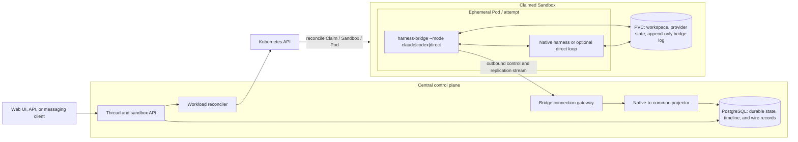

# Harness Control Plane design

Status: **proposal**. This is a new product design, not a description of the current Haku Console
implementation. See the [document index](README.md).

## Executive summary

Run native Claude Code and Codex harnesses in Kubernetes workloads and integrate through their
structured machine protocols, not terminal emulation. A central service commits durable Threads,
inputs, lifecycle, recovery decisions, native evidence, and a common UI timeline to PostgreSQL.
One multi-mode `harness-bridge` process supervises the selected native harness inside each
workload. Kubernetes and PVCs provide replaceable compute with explicit persisted state; they do
not promise live-process hibernation.

The architecture deliberately separates three surfaces:

1. a private bridge control and evidence-replication protocol for admission, fencing, replay, and
   recovery;
2. an internal harness-neutral timeline API for the product UI and orchestration;
3. an optional opaque A2A facade for Agent-to-Agent tasks, messages, artifacts, cancellation, and
   follow-up context.

Claude Code and Codex are parallel first adapters. Native harnesses remain the baseline because
they already own provider-specific agent-loop behavior. A direct LLM API loop is a possible later
adapter, not the abstraction around which the native adapters are designed.

## Problem

Coding-agent products need to start, observe, steer, interrupt, suspend, resume, replace, and debug
native harnesses such as Claude Code and Codex. A terminal multiplexer is useful for a human, but it
is a poor machine integration boundary.

[Gas Town's provider integration guide](https://github.com/gastownhall/gastown/blob/main/docs/agent-provider-integration.md)
describes a zero-integration path based on launching a harness in tmux, using `send-keys`, guessing
readiness from a pane or delay, and reading output with `capture-pane`. The guide correctly calls
out the result: timing sensitivity and no delivery confirmation. Gas City adds provider and
Kubernetes abstractions around this, but a tmux backend still cannot prove which turn accepted an
input or which structured operation produced output.

This design uses a different boundary: **run each native harness in a Kubernetes workload and speak
its machine protocol**. Claude Code is driven through its structured stream/control interface.
Codex is driven through app-server JSON-RPC. The normal workload does not expose an interactive
harness terminal. Diagnosis uses stored native records, bridge and child-process logs, and
Kubernetes workload state.

The harder problem is continuity rather than process launch. A useful product must distinguish:

- input accepted by the central service from bytes merely offered to a workload;
- bridge-local durability from provider-native admission;
- a durable user Thread from replaceable Pods, bridge processes, and native harness processes;
- a server reconnect from process death, Pod replacement, intentional suspension, or storage loss;
- a proven terminal outcome from a crash window where side effects may have occurred.

Without those distinctions, automatic recovery can duplicate work, lose accepted input, or report
success and interruption that the provider never proved.

## Constraints

### Product constraints

- Claude Code and Codex are both first-version adapters. The common model cannot stabilize around
  one and retrofit the other later.
- Native harness behavior is preserved by default, including provider-native history, compaction,
  overflow handling, steering, interruption, and resume behavior.
- One bridge executable supports provider modes rather than creating unrelated control-plane
  implementations.
- PostgreSQL is the sole first-version central authority for durable orchestration state and
  evidence. Kubernetes objects describe and realize workload state; they are not the conversation
  log.
- The product-facing identity is one durable Thread. A Pod or native process is a replaceable
  runtime attempt, not the conversation identity.
- Agent Sandbox is the preferred first Kubernetes backend, but the central protocol cannot depend
  on one controller's object names or implementation details.

### Protocol and recovery constraints

- The workload boundary uses Claude stream/control records and Codex app-server JSON-RPC. PTY
  timing, pane scraping, prompt detection, and `kubectl exec` are not harness integration paths.
- Central acceptance, bridge durability, provider admission, and terminal evidence are separate
  states.
- Transport redelivery is deduplicated, but uncertain provider input is never blindly replayed.
- Stale workload generations are fenced from admitting input or appending authoritative records.
- Exact provider evidence remains available under explicit retention and redaction tiers. Data is
  never labeled raw if it was reconstructed or redacted.
- Suspension may retain Kubernetes and PVC identity while deleting the Pod. Process memory, PIDs,
  sockets, and in-flight computation are not assumed to survive.
- Every supported behavior is labeled as a native contract, repository evidence, or experiment
  required, and exact provider, bridge, model/configuration, and controller versions are pinned.

### Scope constraints

- This design does not specify credentials, identity/access control, tool governance, approval
  policy, or external tool routing.
- A2A is an optional opaque Agent-to-Agent facade. It does not expose private harness operations,
  wire records, bridge-log state, or recovery internals.
- Recovery claims must be promoted by deterministic, rerunnable experiments with explicit failure
  points and saved bidirectional evidence. Paid inference is minimized.

### Adjacent layers that should stay separate

The first deployable unit may be one **orchestrator** service plus PostgreSQL: it owns Thread/Turn
state, Sandbox lifecycle, bridge connections, native logs, projection, and recovery. It does not
host MCP tools or decide tool authorization. The web UI can be deployed separately and consume the
same orchestrator API.

Later systems should remain independently versioned and deployable:

- a model-capability/catalog or routing layer that answers which configured models support which
  workloads without becoming the orchestration authority;
- a stateless MCP gateway that accepts an opaque authorization principal, applies tool-level
  policy, and can turn an operator-approved escalation into a narrow temporary grant without an
  Agent or Sandbox rollout;
- inbound adapters for GitHub, personal notifications, schedules, and Agent-to-Agent messages that
  commit ordinary accepted inputs with explicit provenance envelopes.

The authorization layer should not need to understand Thread, Turn, native Session, or Sandbox
semantics. The orchestrator may bind a runtime to an opaque principal, but **Agent identity**,
**runtime identity**, and **authorization principal** are deliberately separate concepts. The exact
RBAC and approval model remains out of scope until concrete supported actions justify it.

## Goals

- Run each live harness attempt in a bounded Pod or sandbox-backed workload.
- Let a central server own durable thread identity, accepted input, workload desired state,
  recovery decisions, normalized rollout history, and user-visible status.
- Put one small `harness-bridge` binary in each workload. Provider modes launch and supervise
  Claude Code, Codex, or an optional direct-LLM loop behind the same central protocol.
- Preserve native Claude Code and Codex behavior as the default path. A direct-LLM loop is an
  explicit alternative, not the baseline implementation.
- Retain native traffic evidence as provenance while presenting common conversation and operation
  concepts in the UI.
- Make central-server failure, bridge failure, harness-process failure, Pod loss, and intentional
  suspension separate and observable recovery cases.
- Keep a suspended sandbox's PVC-backed workspace without paying for a running Pod.
- Promote recovery behavior to a product guarantee only after pinned, rerunnable provider
  experiments prove it.

## Non-goals

- No generic workflow DSL, issue tracker, merge queue, or multi-agent role system.
- No requirement that every provider feature collapse into one lowest-common-denominator API.
- No promise that an in-flight provider turn can continue after process or Pod death. That is an
  experiment question, not an assumption.
- No process hibernation claim for Kubernetes suspension. Ordinary suspension deletes the Pod.
- No pane scraping, prompt detection, PTY timing, or `kubectl exec` in the production control path.
- No single permanent Kubernetes backend. Agent Sandbox is the preferred first backend, behind a
  narrow provisioning interface that can also support plain Pods.

## Decision summary

| Decision                | Selected approach                                                        | Alternative not selected                                                                      |
| ----------------------- | ------------------------------------------------------------------------ | --------------------------------------------------------------------------------------------- |
| Harness integration     | Native structured protocols                                              | tmux, PTY automation, pane scraping                                                           |
| Provider packaging      | One `harness-bridge --mode claude\|codex\|direct`                        | Separate unrelated bridge products or readers racing from sidecars                            |
| Durable authority       | PostgreSQL                                                               | Pod-local state, Kubernetes CR status, or an event broker as the conversation source of truth |
| Continuity identity     | Durable Thread with replaceable Attempts and native process generations  | Treating a Pod, provider process, or current Session id as the product conversation           |
| Recovery policy         | Evidence-based reconciliation with explicit uncertainty                  | Blind prompt replay or inferred success/interruption after a crash                            |
| Runtime lifecycle       | Agent Sandbox/Pod plus explicit PVC persistence and cold process restart | Claiming suspend is hibernation or that a detached process survives Pod deletion              |
| Agent-loop baseline     | Native Claude Code and Codex                                             | Rebuilding both loops around direct model APIs in v0                                          |
| External Agent protocol | Optional opaque A2A facade                                               | A2A as the private bridge protocol or as an export of harness/tool internals                  |

## Alternatives considered

### Terminal, PTY, or tmux automation

Rejected as the machine correctness boundary. It sends keystrokes rather than correlated requests,
guesses readiness, loses structured identifiers, and cannot prove provider admission or terminal
outcomes. The selected non-interactive modes are diagnosed from their structured records and
process/workload logs rather than by attaching to a terminal UI.

| Terminal-driven integration   | Selected structured integration                 |
| ----------------------------- | ----------------------------------------------- |
| Sends keystrokes              | Sends native structured requests                |
| Guesses readiness             | Completes an explicit handshake                 |
| Scrapes ANSI/pane text        | Receives correlated records and terminal events |
| Reattach means finding a pane | Reconciles durable state and a native session   |
| Cannot prove prompt admission | Records bridge and native admission evidence    |

### Claude Agent SDK as a separate runtime architecture

This is not actually a distinct alternative to the Claude binary. The pinned Python Agent SDK
launches `claude` as a subprocess with stream-JSON input/output and implements convenience routing
around that wire. Ducktape already records this in the
[mid-turn input analysis](../../haku/runner/docs/mid_turn_input.md#claude-code-stream-json-protocol)
and [CLI protocol ownership decision](../../haku/plans/cli_protocol_ownership.md).

The SDK can remain a source of protocol evidence, fixtures, and implementation patterns. The bridge
still owns the CLI wire directly because it needs exact native records, explicit initialization,
input admission evidence, fencing, and replay/recovery semantics that must remain stable across
language SDK wrappers. This is a choice of integration ownership, not a claim that the SDK uses a
different agent loop.

### Direct LLM API agent loop

Deferred as an optional adapter. A direct loop offers exact ownership of model requests but must
also implement streaming assembly, tool-call correlation, overflow/spill behavior, compaction,
retry, cancellation, partial-output recovery, and durable model-facing history. Rebuilding that
machinery before proving both native adapters creates more protocol surface and loses the required
native Claude path.

### Separate provider bridge binaries or a sidecar reader

Rejected for v0. Separate products invite drift in lifecycle, fencing, replication, and transport
behavior.
A sidecar cannot safely discover and attach to process-local stdin/stdout after launch, and multiple
readers can race. One executable with provider adapters shares the durable bridge contract while
keeping native protocol code isolated by mode.

### Kubernetes CRs as the conversation authority

Rejected. Kubernetes is excellent at desired/observed workload reconciliation but is not the right
append-only, totally ordered store for accepted inputs, native evidence, and a long-lived
conversation timeline. Agent-oriented CRDs can inform the workload API shape, conditions, and
ownership model; PostgreSQL remains authoritative for Thread and Turn continuity.

### kagent `SandboxAgent`, `AgentInstance`, or Agent Substrate as the runtime model

Not adopted as the v0 control-plane API, but the evolution is useful evidence. `SandboxAgent` is a
kagent CRD, not a Kubernetes SIG Agent Sandbox resource. Its backend changed from creating an Agent
Sandbox `Sandbox` in kagent v0.9.x to creating suspendable Agent Substrate actors in the v0.10
release-candidate line. On current kagent main at commit
[`8905d1c`](https://github.com/kagent-dev/kagent/tree/8905d1ca417e4094e6c6fc55a045dd6842d58ec9),
the CRD types remain but the dedicated controller has been removed. It should not be treated as a
stable current abstraction to copy.

Current kagent instead uses a database-backed `AgentInstance` resource with explicit
create/suspend/resume/delete operations, task/event rows, and exact snapshot identities. At
quiescent task boundaries it may suspend the underlying actor while retaining the logical instance.
That shape supports this design's central conclusion: durable Agent/Thread identity belongs in a
database, while a replaceable runtime is reconciled beneath it.

Agent Substrate's actor snapshots are a credible later runtime backend if PVC cold-start latency or
placement economics justify another dependency. They are not required to prove the first native
Claude/Codex slices, and adopting them would not remove the need for PostgreSQL input admission,
native evidence, provider resume, or uncertain-dispatch semantics.

### Process hibernation or live-process reattachment as cross-Pod recovery

Rejected as a portability assumption. A supervisor may reattach to a still-running child while its
Pod survives, but ordinary Sandbox suspension and Pod replacement destroy process memory. Cross-Pod
continuity therefore depends on central records, persisted native/workspace state, and provider
resume behavior proven against pinned versions.

### OpenClaw or another generic agent runtime as continuity authority

Rejected for this layer. Such runtimes can be clients, operator tools, or experimental brain
runtimes, but they do not replace exact Claude/Codex protocol ownership, admission evidence,
attempt fencing, Kubernetes recovery, and native reprojection. The control plane should preserve
native harness affordances rather than rebuild them behind a broader chat abstraction.

### A2A as the private harness protocol

Rejected. A2A fits opaque Agent-to-Agent tasks, messages, artifacts, cancellation, and context
continuation. It does not define bridge-log cursors, stale-writer fencing, provider admission,
native process generations, exact wire evidence, or Kubernetes/PVC recovery. Those stay private;
the internal UI timeline is also richer than the optional A2A projection.

## Working architectural vocabulary

These names are intentionally narrow working terms, not a commitment to final UI labels:

- **Agent**: configured model-facing persona/brain identity. It is not itself an RBAC principal.
- **Thread**: durable ordered interaction context for one speaking Agent/harness identity. It
  survives workload replacement. A UI may label it “conversation,” but the protocol avoids the
  overloaded `Session` noun.
- **Input**: one durably accepted inbound delivery. It may originate from a human, another Agent,
  an automation, or an external event. A provenance envelope distinguishes those sources even if
  the provider must receive the content in a model-facing user role.
- **Turn**: one provider execution bracket with one initiating input and zero or more steering
  inputs. Every input remains independently identified and admitted.
- **Sandbox record**: durable environment/storage identity, desired operating mode, provider, PVC
  policy, and current Kubernetes references. It is neither the Agent nor the Thread.
- **Attempt**: one bridge/Pod incarnation. This is the internal/API term; operator UI should prefer
  **runtime attempt** or simply **runtime**. Avoid bare **run**, which is overloaded across model,
  workflow, and harness systems.
- **Native process generation**: one child harness process within an attempt. Restarting the child
  increments this generation without pretending the Pod or bridge changed.
- **Native session**: the provider's resumable conversation identity, for example a Claude session
  id or Codex thread id. **Session** is reserved for this provider-native concept rather than used
  as a generic product identity.
- **Wire record**: one exact line/message on the native protocol, plus direction and ordering
  metadata.
- **Timeline event**: a durable common projection used by clients. It points back to one or more
  wire records.

Kubernetes object names, Pod UIDs, bridge connection ids, provider session ids, and durable thread
ids are deliberately different identifiers.

## Topology



The central boxes are logical roles. The first implementation uses one replicated service and
PostgreSQL. Metadata, accepted input, lifecycle, common events, and compressed wire-record segments
all live in Postgres. The database, not one server process, is the continuity authority. Another
storage system requires a demonstrated reason; it is not an open design choice.

## Detailed design

### One attempt per Pod; one thread across attempts

A live attempt gets its own process tree, resource limits, and Pod identity. The thread and sandbox
record do not disappear when that Pod does. Replacing a failed attempt is a state transition on the
same durable thread and, when storage survives, the same sandbox.

One live attempt may serve several turns while active. “One attempt per Pod” does not mean one Pod
per prompt.

### The bridge is the workload entrypoint and child supervisor

One `harness-bridge` executable launches the selected provider mode as its child, owns stdin/stdout
or the local socket, performs the native handshake, emits health, and terminates the whole process
group on shutdown. Provider-specific behavior is selected by configuration, not by deploying a
different control-plane binary. This avoids PID discovery, competing readers, and sidecars racing
to attach to process-local pipes.

The bridge has provider adapters but is not the authority for threads, scheduling, or final
user-visible outcomes. It keeps a simple append-only local bridge log on the PVC so a server outage
does not force RAM buffering. V0 does not add cap, truncation, coalescing, or overflow machinery to
this log: native LLM traffic is modest, the PVC is already durable, and storage growth is easier to
observe than a second lossy retention policy.

### The bridge dials outward

The bridge opens an outbound stream to the central gateway. The server does not need per-Pod
ingress, PTY attachment, or `kubectl exec`. On reconnect the bridge announces:

- attempt and sandbox identity;
- the persisted attempt generation/fencing token;
- provider, native version, bridge version, and compatibility profile;
- native process generation, child identity, and current local state;
- last server command durably accepted;
- highest wire sequence durably retained and highest server acknowledgement observed;
- native session and active-turn identifiers, when known.

The server answers with the durable cursor and desired attempt state. Only the current persisted
attempt generation may admit input or append authoritative acknowledgements. A stale partitioned
bridge can reconnect for diagnostics, but its writes are fenced. Replacement waits for confirmed
old-workload termination before it opens a provider-native session for writing. Both sides tolerate
duplicate transport delivery; semantic replay of provider input remains conservative.

Generation fencing protects PostgreSQL authority; it does not stop an old native process from
continuing tools, workspace writes, or provider-session activity while partitioned. The control
plane therefore blocks replacement dispatch and provider-session resume until Kubernetes/process
evidence proves the prior workload cannot continue. If termination cannot be established, the
sandbox remains unavailable in a terminating/recovery-blocked state rather than running two
writers.

### The server commits input before dispatch

The server assigns stable ids and commits accepted input before sending it to an attempt. Dispatch
progress is an explicit state machine, not a boolean:

`accepted -> offered -> bridge_durable -> native_admitted -> terminal`

A disconnect in `accepted` is safe to retry. A disconnect after `native_admitted` may have produced
side effects and must not be replayed automatically unless the provider exposes an operation id or
resume contract that proves replay safe. “Outcome uncertain” is a valid terminal operator state.

### Native protocols are authoritative at the workload edge

Provider adapters own initialization, prompt submission, steering, interruption, resumption, event
interpretation, and native terminal-state detection. The common protocol is a projection for
storage, control, and UI; raw native fields remain available and provider-specific features can pass
through without inventing fake equivalence. See [provider adapters](provider_protocols.md) and the
[common vocabulary](common_protocol.md). Its relationship to A2A 1.0 is evaluated separately in
[A2A fit and protocol layering](a2a.md). Existing code and external prior art are evaluated in
[implementation reuse](implementation_reuse.md).

### Persistent state is explicit

The container root filesystem is disposable. The PVC contains only deliberate continuity material:

```text
/workspace/project/               checked-out project and generated artifacts
/workspace/.harness/claude/       Claude native state selected for persistence
/workspace/.harness/codex/        CODEX_HOME / rollout state selected for persistence
/workspace/.bridge/               attempt manifest and append-only bridge log
```

Exact paths are image configuration, not protocol. Provider state and workspace can be separate
PVCs later if their retention or backup needs diverge.

PostgreSQL retains identities, lifecycle, accepted input, normalized timeline, compressed wire
records, and proven/uncertain outcomes. Large frame streams use partitioned append-only tables and
compressed `bytea`/JSON payloads.

### Native harnesses are the default; a direct agent loop is an option

The first release supports Claude Code and Codex as native harnesses. For Claude, both direct CLI
integration and the Claude Agent SDK ultimately run the Claude Code binary; the bridge chooses to
own that binary's stream/control wire directly. This preserves the validated native path while
avoiding another wrapper as the recovery boundary. For both providers, native harnesses avoid
rebuilding context compaction, tool-output overflow handling, native session history, steering,
interrupts, provider-specific tools, and upgrade compatibility.

The same bridge binary may later run `--mode direct` against an LLM API. That mode would implement
the agent loop itself and emit the same common inputs, turns, messages, operations, and terminal
events as the native adapters. It is useful when a provider has no suitable harness, when exact loop
behavior matters more than native features, or when API-only deployment is intentional.

The direct mode carries a substantially larger implementation obligation: model streaming,
tool-call assembly, overflow/spill behavior, context and compaction, retries, cancellation,
continuation after partial output, and durable model-facing history. It therefore starts as an
optional third adapter after the Claude and Codex intersections are proven, not as the abstraction
from which those adapters are derived.

## Agent Sandbox lifecycle

The preferred first backend is Kubernetes SIGs Agent Sandbox. Ducktape currently pins
[agent-sandbox v0.5.5](https://github.com/kubernetes-sigs/agent-sandbox/releases/tag/v0.5.5)
(commit [`3ea199b8`](https://github.com/kubernetes-sigs/agent-sandbox/tree/3ea199b8b910f8e838a6000796c29536d592fbdd)).
The active `haku-claude` and `haku-public-coder-codex` templates currently mount 10 GiB
`emptyDir` workspaces; the Claude config/home and Codex home are also ephemeral. A separate legacy
`agent-workspaces` Codex template demonstrates a 10 GiB `volumeClaimTemplate`, but it is not the
active Haku runtime. The current Haku templates therefore lose workspace and native state on Pod
replacement or suspension and cannot satisfy this design as written.

Before any continuity experiment, the Harness Control Plane needs a dedicated template or explicit
template migration that places `/workspace`, selected Claude state, and `CODEX_HOME` on
Sandbox-owned PVCs. It must also set and validate `restartPolicy: Never` for the bridge-entrypoint
Pod. The active templates currently omit it, so Kubernetes would otherwise restart a dead bridge
container inside the same Pod UID and violate the v0 one-Attempt-per-Pod model. The controller
profile rejects templates that do not meet these persistence and restart prerequisites.

The current Codex warm pool keeps one spare Sandbox. Claimed-sandbox suspension remains new behavior
to exercise, not a claim that the existing warm pool is configured to scale to zero. The design
must pin and test the deployed controller rather than infer behavior from a moving upstream branch.

Kubernetes SIGs Agent Sandbox does not define a `SandboxAgent` CRD. In v0.5.5, `SandboxClaim` is an
allocation/checkout handle that creates or adopts a `Sandbox` and reports the assigned Sandbox; it
is not the durable Agent or Thread identity. The similarly named `SandboxAgent` came from kagent
and has since moved through incompatible backends. The central `Sandbox record` in this design is
therefore a PostgreSQL product object that stores the resolved Claim/Sandbox identities rather than
aliasing either Kubernetes object.

The relevant ownership shape is:

```text
SandboxClaim -> Sandbox -> Pod, PVC, optional Service
```

A claim may adopt a warm-pool Sandbox, in which case the Sandbox keeps its pool-generated name, or
cold-create one. The control plane therefore stores both Claim identity and the resolved Sandbox
name/UID; it never derives one from the other.

### Suspension is compute-off, not process freeze

For v0.5.5, setting `Sandbox.spec.operatingMode: Suspended` gracefully deletes the Pod while
retaining the Sandbox CR, PVCs, and requested Service. `Suspended=True` is reported only after the
Pod is gone. Setting the mode back to the running state creates a new Pod wired to the same
Sandbox-owned PVC. This is the pinned
[suspend/resume contract](https://github.com/kubernetes-sigs/agent-sandbox/blob/3ea199b8b910f8e838a6000796c29536d592fbdd/docs/keps/694-kep-for-suspend-and-resume-for-beta/README.md#L117-L129),
implemented by the controller's
[Pod-deletion path](https://github.com/kubernetes-sigs/agent-sandbox/blob/3ea199b8b910f8e838a6000796c29536d592fbdd/controllers/sandbox_controller.go#L1075-L1105).

Consequences:

- `/workspace` survives when correctly mounted from the PVC.
- Process memory, PIDs, open sockets, Pod IP, and writes outside persistent mounts do not survive.
- The Sandbox name/UID and PVC identity remain stable across ordinary suspend/resume and Pod
  recreation because PVCs are reconciled independently and the recreated Pod references the same
  [Sandbox-owned claim names](https://github.com/kubernetes-sigs/agent-sandbox/blob/3ea199b8b910f8e838a6000796c29536d592fbdd/controllers/sandbox_controller.go#L1284-L1313).
  The Pod UID and processes are new.
- Deleting the **Sandbox CR** is different: garbage collection removes its owned PVC. A replacement
  Sandbox is a fresh environment even if a Kubernetes name is reused.
- Scaling a **WarmPool** to zero destroys unused pool-owned Sandboxes and their PVCs through
  [Sandbox deletion](https://github.com/kubernetes-sigs/agent-sandbox/blob/3ea199b8b910f8e838a6000796c29536d592fbdd/extensions/controllers/sandboxwarmpool_controller.go#L676-L733).
  It does not suspend claimed environments.

These are controller semantics, not yet an end-to-end product guarantee. The experiment suite must
still prove storage class behavior, mount contents, native state paths, and exact image pins in the
target cluster.

### Product sandbox states

```mermaid
stateDiagram-v2
    [*] --> Allocating
    Allocating --> Active: Pod ready + bridge/native handshake
    Allocating --> Failed: allocation or bootstrap failure

    Active --> Suspending: explicit operator request while idle
    Suspending --> Suspended: Pod absent; Sandbox + PVC retained
    Suspended --> Resuming: new input or operator request
    Resuming --> Active: new Pod + native resume/new attempt

    Active --> Recovering: bridge, harness, or Pod lost
    Recovering --> Active: replacement attempt reconciled
    Recovering --> NeedsAttention: continuity or dispatch uncertain

    Active --> Failed: unrecoverable attempt failure
    Failed --> Recovering: retry requested
    NeedsAttention --> Recovering: operator chooses recovery

    Suspended --> Disposing: explicit confirmed disposal
    Active --> Disposing: explicit confirmed disposal while idle
    Failed --> Disposing: explicit confirmed disposal
    Disposing --> Disposed: Claim/Sandbox/PVC deleted
    Disposed --> [*]
```



`Suspended` remains visible in the product. It is not deletion and not “offline unknown.” `Disposed`
is an explicit destructive lifecycle transition. V0 has no automatic Sandbox disposal timer: the
operator uses a visible destructive action and confirmation. Central Thread, timeline, and audit
records are not deleted merely because Sandbox storage is disposed.

### Suspend policy

Suspension starts as a manual, idle-only action. The API rejects it while a Turn is active,
interrupting, recovering, or outcome-uncertain; the operator must first let the Turn finish or
explicitly interrupt it and wait for an honest terminal observation. There is no forced active-turn
suspension path in v0. Here **idle** also means there is no accepted/offered input awaiting native
admission or a future Turn.

The suspension path is:

1. stop admitting new turns;
2. require the attempt to be idle;
3. flush native records and the append-only bridge log through a durable acknowledgement;
4. record native session id and compatibility metadata;
5. terminate the child cleanly within a deadline;
6. set the Sandbox to `Suspended`;
7. wait for the controller's suspended condition and Pod absence;
8. mark the product sandbox `Suspended`.

Resume reverses compute state, not process state: create the Pod, start a new attempt, verify the
PVC, perform the provider handshake, and then either resume the native session or start a new native
session with an explicit continuity break.

### Disposal policy

Disposal begins only from an explicit operator action on the Sandbox inventory or detail view. The
UI names the consequences—Claim/Sandbox deletion and loss of Sandbox-owned PVC contents—and requires
confirmation. An active Turn or pending accepted input disables disposal until it is terminal or
explicitly cancelled; a failed or uncertain Sandbox requires an additional acknowledgement that
remaining native state may be abandoned. Automatic retention policies may be reconsidered after
real usage, but are not part of v0.

## Nominal lifecycle

```mermaid
sequenceDiagram
    participant U as User
    participant S as Central server
    participant D as Central durable stores
    participant K as Kubernetes
    participant B as harness-bridge + PVC log
    participant H as Native harness

    U->>S: Submit input to durable thread
    S->>D: Commit input + stable ids
    S->>K: Ensure claimed Sandbox is running
    K-->>B: Start Pod and mount PVC
    B->>H: Launch + native initialize/resume
    B->>S: Authenticate; announce attempt and cursors
    S->>B: Offer committed input
    B->>B: Persist local acceptance in append-only PVC log
    B-->>S: bridge_durable acknowledgement
    B->>H: Native prompt / turn request
    H-->>B: Native admission id / event
    B-->>S: native_admitted evidence
    H-->>B: Stream native records
    B-->>S: Forward sequenced records
    S->>D: Append wire log + project timeline
    S-->>U: Stream common rollout with raw-frame drill-down
    H-->>B: Native terminal event
    B-->>S: Terminal evidence
    S->>D: Commit proven outcome
```

The bridge log in the diagram is local to the workload; it is not a substitute for the central input
commit or timeline.

## Recovery cases

### Central-server replica or connection failure

The harness and bridge may continue while the server is unavailable. The bridge appends wire
records to its PVC log. After a new server replica accepts the outbound reconnect, both sides
exchange cursors, the bridge retransmits missing records, and the server deduplicates by attempt and
wire sequence. V0 does not impose a separate logical bridge-log cap. Filesystem exhaustion is an ordinary
storage failure that must be alerted and surfaced honestly; the bridge never silently truncates the
log or invents a complete turn across missing evidence.

### Harness child process failure while the Pod survives

The bridge records exit code/signal, stderr tail, last wire position, native session id, and active
turn id. It must not assume the active turn failed before side effects. Recovery starts a new child
inside the same Pod with an incremented `native_process_generation`, or starts a replacement
attempt. Native resume is used only if the compatibility suite has proven the exact case.

Process supervision APIs can detach and reattach while the containing Pod survives, but cannot keep
a PID alive after that Pod is deleted.

### Bridge process failure

Because the bridge is PID 1/entrypoint and the v0 template requires `restartPolicy: Never`, its
failure terminates the attempt without an in-place container restart. The central server observes
the terminated Pod/process, deletes the failed Pod if needed so Agent Sandbox reconciles a new one,
and only then issues a replacement generation. The replacement reuses the PVC and reconciles the
bridge log before dispatching more input.

### Pod loss while Sandbox and PVC survive

The controller recreates a new Pod against the same PVC. The server creates a new attempt id,
verifies the Sandbox UID and PVC sentinel, starts the native harness, and attempts provider-native
resume. Workspace persistence and conversation resumption are separate assertions: one may work
while the other does not.

### Sandbox CR or PVC loss

This is environment loss, not ordinary attempt recovery. The control plane opens a new Sandbox,
marks the previous workspace unavailable, and requires an explicit restoration path from Git or
backup. It must not claim native continuity from a coincidentally reused name.

### Uncertain dispatch

If a provider may have admitted a turn but terminal evidence is absent, the UI shows the accepted
input, last proven provider event, known workspace facts, and an uncertain outcome. Recovery choices
are explicit: inspect, resume provider session, start a new follow-up without automatically
redispatching the original input, or abandon the turn. A follow-up can still cause new side effects;
it is not presented as a safety guarantee. Blindly resending the original prompt is not the default.

## Recovery matrix

| Failure                    | What survives                         | Automatic action                             | Required visible caveat                   |
| -------------------------- | ------------------------------------- | -------------------------------------------- | ----------------------------------------- |
| Central replica restart    | Pod, bridge, harness, PVC, local log  | Reconnect and replay wire gap                | Show reconnect only if it delays output   |
| Bridge-server network loss | Child and PVC                         | Append locally, reconnect, replay            | Alert if storage itself becomes unhealthy |
| Harness process exits idle | Pod and PVC                           | Restart child; native resume if proven       | New native process generation             |
| Harness exits mid-turn     | PVC; perhaps provider history         | Resume or replace only per experiment result | Turn may be interrupted or uncertain      |
| Bridge/Pod dies            | Sandbox and PVC                       | Recreate Pod and attempt                     | Process memory is gone                    |
| Intentional suspend        | Sandbox, PVC, central history         | Delete Pod; later create new attempt         | Resume is cold process start              |
| Sandbox CR deleted         | Central history only unless backed up | Allocate fresh environment                   | Workspace/provider state lost             |
| PVC unavailable/corrupt    | Central history and wire records      | Stop; restoration workflow                   | No false continuity claim                 |

## Web UI

### Sandbox inventory

The primary inventory lists durable sandbox records, not only running Pods. It uses two independent
axes:

- **Sandbox lifecycle**: allocating, active, suspending, suspended, resuming, failed, disposing,
  disposed.
- **Attempt/turn activity**: idle, starting, working, steering, interrupting, recovering, uncertain.

Default groups are derived from those axes:

- **Active**: a Pod is expected or present; activity shows whether it is idle, working, or
  recovering.
- **Suspended**: Pod absent by policy; PVC retained; last native session and last activity shown.
- **Needs attention**: failed, evidence gap, uncertain turn, storage mismatch, or recovery blocked.
- **Disposed**: Sandbox storage is gone; central audit metadata remains available.

Each row shows provider/version, thread, desired/observed mode, Claim and resolved Sandbox identity,
Pod age when present, workspace/PVC status, active turn, last durable event, and available actions.
The UI must not render a suspended sandbox as a failed Pod. **Suspend** is enabled only when the
runtime is idle. **Dispose** is a separately confirmed destructive action, never a retention-window
side effect.

### Conversation rollout

The thread page renders the common timeline as a conversation:

- accepted user prompts;
- assistant messages and readable reasoning summaries;
- operation cards for shell, file changes, and generic tool/provider operations;
- interrupt/steer inputs and whether they were admitted;
- attempt, reconnect, suspension, resume, and uncertainty markers.

A “native frames” toggle interleaves restricted raw evidence or redacted/coalesced provider records
at their exact timeline anchors. Drill-down shows direction, native sequence range, provider ids,
evidence tier, projection version, and whether the frame was live, replayed, or recovered from the
bridge log. Provider detail never changes the ordering of the common rollout.

### Raw-frame retention and coalescing

Every native input/output record receives a sequence within `(attempt_id,
native_process_generation)` before projection and a central `thread_seq` when Postgres accepts it.
The store may coalesce high-frequency text, reasoning, command-output, or tool-input deltas into
compressed segments after a turn becomes terminal, provided that it preserves:

- exact post-redaction bytes or JSON values and ordering;
- first/last native sequence and timestamps;
- item/turn correlation;
- content hash and redaction metadata;
- the ability to reconstruct the logical stream used by the projector.

Tool starts/completions, errors, interruption results, and provider terminal events remain
individually addressable. Coalescing is storage compaction, not semantic loss.

Evidence has two explicit tiers:

- **Restricted raw evidence**: encrypted native bytes for short-retention diagnosis and exact
  reprojection. Pre-redaction hashes cover this tier.
- **Operational evidence**: redacted native records and common events used by routine UI and
  long-term history. Post-redaction hashes cover this tier.

The append-only bridge log remains on encrypted Sandbox storage until explicit archival or disposal.
V0 does not independently cap or coalesce it. A record never claims to be “exact raw” if only the
redacted central tier is retained.

## Implementation lanes

1. **Evidence harness**: implement the version-pinned provider experiment runner and golden native
   fixtures before making recovery promises.
2. **Durable core**: define Thread, Sandbox, Attempt, native process generation, fencing token,
   input admission, native wire log, and common timeline tables in PostgreSQL with explicit
   uncertain outcomes.
3. **Claude vertical slice**: one Sandbox, bridge-supervised Claude process, one turn, wire storage,
   normalized rollout, interrupt, and clean native resume.
4. **Codex vertical slice**: durable non-ephemeral Codex thread, app-server resume, operation
   normalization, interrupt, and steering.
5. **Server reconnect**: append-only bridge log, cursor handshake, replay/deduplication, and replica
   adoption.
6. **Sandbox recovery**: Pod delete, process kill, suspend/resume, PVC sentinels, and UI states.
7. **Operator UI**: active/suspended inventory, conversation rollout, raw-frame toggle, uncertain
   outcome recovery controls.
8. **Direct-loop spike**: after both native adapters pass, prove that an API-driven loop can emit the
   same common protocol without making it the default.
9. **Production hardening**: backups, central evidence retention, capacity alerts, version gates,
   metrics, and controlled provider upgrades.

The Claude and Codex slices proceed in parallel. The common protocol does not stabilize from one
adapter and retrofit the other later.

## Open decisions

- gRPC stream, WebSocket, or another transport between bridge and server?
- Should acknowledged bridge-log segments remain for the full Sandbox lifetime or move to a simple
  explicit archival action later?
- Which Claude state directories are both necessary and safe to persist?
- Should provider state share the project PVC or use an independently retained volume?
- What exact event subset is retained indefinitely versus compacted or expired?
- Is automatic active-turn recovery ever safe, or should all mid-turn process loss require an
  explicit continuation?
- Which controller conditions and timeouts define “suspended” and “resumed” for each pinned Agent
  Sandbox release?
- Which final UI labels replace the protocol's working nouns `Thread`, `Turn`, and `Attempt`?

The experiment plan is the promotion gate for these decisions, not an appendix to implementation.
