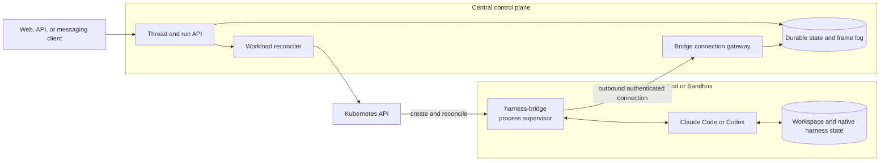
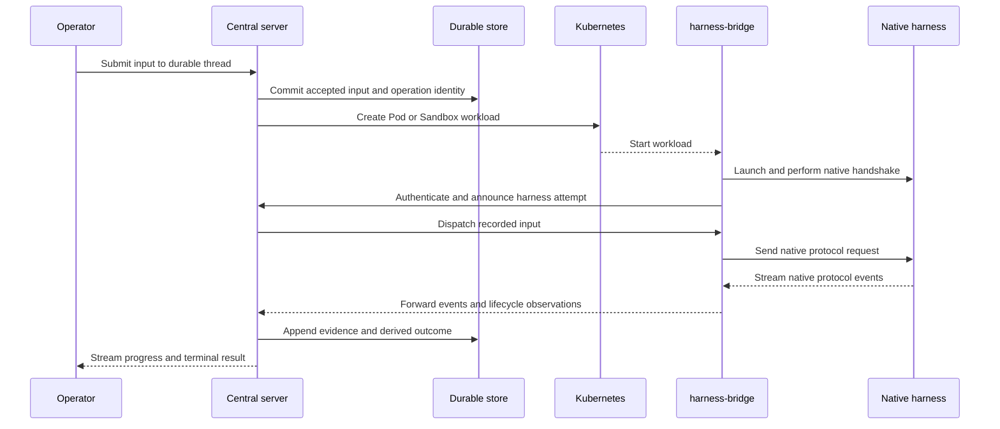

# Kubernetes harness control plane

Status: **proposal**. This is a fresh architecture sketch, not a description of the current Haku
Console implementation.

## Problem

Coding-agent orchestrators need to start, observe, steer, stop, and recover native harnesses such
as Claude Code and Codex. A terminal multiplexer is a useful operator UI, but it is a poor machine
integration boundary.

[Gas Town's provider integration guide](https://github.com/gastownhall/gastown/blob/main/docs/agent-provider-integration.md)
describes its zero-integration path directly: launch a harness in tmux, send work with
`send-keys`, infer readiness from the pane or a delay, and read output with `capture-pane`. The
guide also names the consequence: the shim is timing-sensitive and has no delivery confirmation.
Gas City has since added several runtime providers, including ACP and Kubernetes, but tmux remains
its default session backend and fallback.

This design takes a different boundary: **run each harness in a Kubernetes workload and speak the
harness's machine integration protocol**. Claude Code should be driven through its structured
stream/control interface; Codex should be driven through app-server JSON-RPC. Terminal emulation is
for human diagnostics, not control-plane correctness.

## Goals

- Run each harness attempt in its own Kubernetes Pod or sandbox-backed workload.
- Let a central server create, reconcile, observe, and retire those workloads.
- Put a small bridge binary beside the harness to own local process lifecycle and the connection to
  the central server.
- Drive each harness through its structured integration surface rather than keystrokes, prompt
  scraping, terminal timing, or ANSI parsing.
- Record enough durable state centrally that a server restart, connection loss, or Pod failure has
  an explicit outcome rather than silently losing work.
- Preserve native harness behavior instead of replacing Claude Code or Codex with a home-grown
  agent loop.

## Non-goals

- **No harness-neutral conversation protocol yet.** This document does not define a shared prompt,
  turn, tool, approval, delta, or transcript schema across Claude Code and Codex.
- No generic workflow language, multi-agent scheduler, merge queue, or issue tracker.
- No commitment to one sandbox implementation. A plain Pod, Job, or a Sandbox custom resource can
  implement the workload boundary.
- No terminal UI design. Operators may still attach a terminal for diagnosis, but the server must
  not depend on it.
- No attempt to hide harness-specific capabilities. A feature available only in one native
  protocol remains harness-specific until there is evidence for a useful common contract.

## Architectural decisions

### One harness attempt is one workload

A central server provisions one workload for one live harness attempt. The durable user-facing
thread may outlive many attempts; a Pod identity must not become the identity of the conversation.
This gives each attempt a bounded workspace, process tree, resource budget, credential set, and
network policy.

The preferred Kubernetes backend is a sandbox custom resource when it supplies useful isolation,
persistence, warm pools, or lifecycle semantics. The control plane should depend on a narrow
provisioning interface so the first implementation can use ordinary Pods without making Pod YAML
the permanent API.

### The bridge supervises the harness

The workload entrypoint is a small `harness-bridge` binary. It launches the native harness as a
child process, owns its stdin/stdout or local socket, performs the native handshake, reports health,
and terminates the process tree when the workload ends.

This is usually better than a sidecar that discovers an unrelated process: Claude Code and Codex
expose process-local structured interfaces, so the component that starts them can establish the
protocol connection without PID discovery, PTY scraping, or races over pipe ownership. A separate
sidecar remains possible for a harness that exposes a stable local network API.

The bridge is not the durable control plane. It must not become the authority for user threads,
work assignment, policy, or final operation status.

### The server owns durable truth

Before dispatching work, the server records the accepted input and its identity. It also records
workload identity, bridge connection state, native frames or events needed for diagnosis, and the
terminal outcome it can actually prove.

A disappearing bridge does not imply that the harness stopped before performing a side effect.
Unknown outcomes remain unknown until reconciled; the server must not silently replay an uncertain
turn as if it had never started.

### Native protocol at the harness edge

Each harness adapter speaks the harness's documented or deliberately compatibility-tested machine
interface:

- Claude Code: structured stream input/output and its control channel.
- Codex: app-server JSON-RPC.
- A future harness: ACP or another native API only if that API covers the required lifecycle and
  control semantics.

The bridge/server transport may carry a small shared lifecycle envelope plus opaque native payloads,
but this proposal does not normalize their meaning. Harness-specific code remains responsible for
initialization, resume, prompt submission, interruption, event interpretation, and terminal-state
detection.

### The bridge dials out

The bridge opens an authenticated outbound connection to the central server. The server does not
`kubectl exec`, attach to a PTY, poll a pane, or require routable per-Pod ingress.

Outbound dialing works with ordinary Services, restrictive Pod networking, warm sandboxes, and
rolling central-server replicas. The exact transport, resumption cursor, acknowledgement scheme,
and version negotiation are intentionally deferred, but reconnect and duplicate delivery must be
assumed in the eventual design.

## Topology

The boxes inside the central control plane are logical roles, not a requirement for four services.
A first implementation can be one server process backed by one durable database.

## Nominal lifecycle

Provisioning need not happen for every turn. A live harness attempt can serve multiple turns while
its thread is active; the important boundary is that the server can replace the attempt without
changing the durable thread's identity.

## Responsibility split

| Concern                            | Central server                         | Harness workload                      |
| ---------------------------------- | -------------------------------------- | ------------------------------------- |
| Durable thread and accepted input  | Authoritative                          | Receives a dispatched copy            |
| Kubernetes desired state           | Authoritative                          | Reports observed local state          |
| Harness process                    | Requests lifecycle                     | Launches, monitors, and terminates    |
| Native protocol semantics          | Harness-specific server/bridge adapter | Speaks the native local wire          |
| Workspace and native session files | Records location and policy            | Mounts and reads/writes them          |
| User-visible progress and outcome  | Persists and serves                    | Supplies evidence                     |
| Credentials and policy             | Issues scoped configuration            | Uses only the attempt's grants        |
| Recovery decision                  | Reconciles durable and observed facts  | Reconnects and reports retained facts |

## Failure model

The first implementation should name these outcomes rather than collapsing them into "agent
stopped":

| Failure                                         | Required behavior                                                                              |
| ----------------------------------------------- | ---------------------------------------------------------------------------------------------- |
| Central-server replica restarts                 | The bridge reconnects; another replica can adopt the attempt from durable state.               |
| Bridge connection drops                         | The harness may continue under a bounded local buffer; loss and overflow are explicit.         |
| Harness process exits                           | The bridge reports exit status, signal, stderr tail, and last native protocol position.        |
| Pod or sandbox disappears                       | The reconciler records workload loss and decides whether a new attempt may resume.             |
| Input was recorded but never dispatched         | Safe to dispatch once the server proves no attempt accepted it.                                |
| Dispatch may have reached the harness           | Do not silently replay; expose an uncertain outcome or reconcile by native operation identity. |
| Server and bridge disagree about terminal state | Preserve both observations and resolve from the durable evidence, not last-writer-wins memory. |

These requirements are why terminal keystrokes are the wrong seam: pane text cannot prove whether a
prompt was accepted, which turn produced an output fragment, whether an interrupt targeted the
right operation, or whether replay is safe.

## Security boundary

- Give each workload a scoped identity and only the credentials required for that harness attempt.
- Prefer short-lived credentials delivered at launch over mounting operator-wide configuration.
- Do not mount a Kubernetes service-account token unless the harness workload itself needs the
  Kubernetes API. The central reconciler, not the harness, normally owns provisioning authority.
- Apply CPU, memory, storage, process-count, and wall-clock limits at the workload boundary.
- Apply default-deny ingress and explicit egress policy. The outbound bridge connection and model or
  tool endpoints are named exceptions.
- Keep native harness state and project workspaces on deliberate volumes; do not make the container
  root filesystem accidental persistence.
- Treat raw native frames and transcripts as sensitive operator data. Redaction and retention belong
  in the central persistence boundary.

## Why this is not tmux orchestration

| Terminal-driven orchestration               | This design                                                          |
| ------------------------------------------- | -------------------------------------------------------------------- |
| Sends keystrokes to a pane                  | Sends a typed native protocol request                                |
| Guesses readiness from prompts or delays    | Completes an explicit protocol handshake                             |
| Scrapes ANSI-formatted output               | Receives structured events and terminal responses                    |
| Infers liveness from a pane or process name | Observes bridge, child process, and workload state                   |
| Cannot confirm prompt delivery              | Designs explicit operation identity and acknowledgement              |
| Reattach means reconnecting a terminal      | Recovery reconciles durable server state with a live harness attempt |
| Human terminal behavior is the API          | Human terminal attachment is diagnostic only                         |

The useful idea in Gas Town and Gas City is the orchestration layer around work, roles, and runtime
providers. The part not adopted here is terminal emulation as the correctness boundary. Where ACP
or another structured provider is complete enough, it is much closer to this design than a tmux
provider is.

## Initial implementation slices

1. **One harness, one Pod, one native protocol.** Provision a Claude Code workload, launch it under
   the bridge, complete its native handshake, submit one turn, stream events, and record a proven
   terminal result.
2. **Durable dispatch and reconnect.** Record input before dispatch, reconnect a bridge across a
   central-server restart, and make duplicate or uncertain delivery visible.
3. **Second harness.** Add Codex app-server without changing the first harness's native semantics.
   Shared code should emerge only around workload lifecycle, transport, and evidence storage.
4. **Sandbox backend.** Put the same workload contract behind a Sandbox CR and measure isolation,
   startup latency, persistence, warm-pool behavior, and cleanup.
5. **Recovery and operations.** Add attempt replacement, native resume where supported, resource
   accounting, logs, and operator-visible failure states.

## Questions deliberately left open

- Is the bridge one binary with harness-specific backends, or one small binary/image per harness?
- Which logic belongs in the bridge versus a harness-specific central-server adapter?
- What transport carries lifecycle messages and opaque native frames?
- What acknowledgement and replay contract survives a server crash without duplicating side
  effects?
- Which native harness files must persist across workload replacement, and which should be exported
  to central storage?
- Is the default allocation one workload per durable thread, per active run, or a pooled workload
  leased to a run?
- Which sandbox CRD is the first backend, and what contract is common with plain Pods?
- When there are two proven implementations, what semantics are genuinely common enough to earn a
  harness-neutral protocol?

That last question is intentionally answered by implementation evidence later, not by inventing an
abstraction before Claude Code and Codex have both exercised the architecture.
