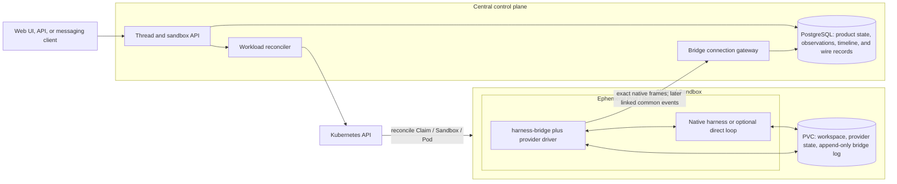

# Harness Control Plane design

Status: **proposal**. This is a new product design, not a description of the current Haku Console
implementation. See the [document index](README.md).

## Executive summary

Run native Claude Code and Codex harnesses in Kubernetes workloads and integrate through their
structured machine protocols, not terminal emulation. A central service commits durable Threads,
inputs, lifecycle, recovery decisions, native evidence, and a common UI timeline to PostgreSQL.
One multi-mode `harness-bridge` process supervises the selected native harness inside each
workload. Kubernetes and PVCs provide replaceable compute with explicit persisted state; they do
not promise live-process hibernation.

The architecture deliberately separates two surfaces:

1. a future private bridge control and evidence-replication protocol for admission, replay, and
   recovery, derived from the native captures;
2. an internal harness-neutral timeline API for the product UI and orchestration, derived after the
   first raw provider experiments establish the actual Claude/Codex behavior.

Claude Code and Codex are parallel first adapters. Native harnesses remain the baseline because
they already own provider-specific agent-loop behavior. A direct LLM API loop is a possible later
adapter, not the abstraction around which the native adapters are designed.

## Problem

The product need is not merely “run a coding CLI in Kubernetes.” It is:

- run many headless Agents concurrently;
- use Claude Code and Codex because their native harnesses already work against the cluster's
  subscription-backed LiteLLM -> CLIProxyAPI Messages and Responses routes;
- keep subscription login, token refresh, and credential ownership in CLIProxyAPI rather than
  teaching each workload or the Harness Control Plane to manage consumer OAuth;
- avoid making expensive metered model APIs the mandatory baseline when consumer subscriptions are
  the economical path already available to the operator;
- keep Agents useful for days, or eventually for an effectively unbounded Thread receiving a
  stream of messages. A higher layer may later turn subscriptions and external events into
  explicitly enveloped messages sent to an Agent;
- later let Agents delegate to, spawn, and communicate with other Agents without replacing the
  durable single-Agent Thread model;
- survive central-service, bridge, harness-process, and Pod failure without silently losing or
  duplicating accepted work; and
- leave enough correlated evidence that delivery, recovery, and provider bugs can be diagnosed and
  turned into regression fixtures rather than recurring mysteries.

That requires starting, observing, steering, interrupting, suspending, resuming, replacing, and
debugging native harnesses such as Claude Code and Codex. A terminal multiplexer is useful for a
human, but it is a poor machine integration boundary.

[Gas Town's provider integration guide](https://github.com/gastownhall/gastown/blob/main/docs/agent-provider-integration.md)
describes a zero-integration path based on launching a harness in tmux, using `send-keys`, guessing
readiness from a pane or delay, and reading output with `capture-pane`. The guide correctly calls
out the result: timing sensitivity and no delivery confirmation. Gas City adds provider and
Kubernetes abstractions around this, but a tmux backend still cannot prove which turn accepted an
input or which structured operation produced output.

This design uses a different boundary: **run each native harness in a Kubernetes workload and speak
its machine protocol**. Claude Code is driven through its structured stream/control interface.
Codex is driven through app-server JSON-RPC. The normal workload does not expose an interactive
harness terminal. Diagnosis uses stored native records, bridge and child-process logs, and
Kubernetes workload state.

The harder problem is continuity rather than process launch. A useful product must distinguish:

- input accepted by the central service from bytes merely offered to a workload;
- bridge-local durability from provider-native admission;
- a durable user Thread from replaceable Pods, bridge processes, and native harness processes;
- a server reconnect from process death, Pod replacement, intentional suspension, or storage loss;
- a proven terminal outcome from a crash window where side effects may have occurred.

Without those distinctions, automatic recovery can duplicate work, lose accepted input, or report
success and interruption that the provider never proved.

## Constraints

### Product constraints

- Claude Code and Codex are both first-version adapters. The common model cannot stabilize around
  one and retrofit the other later.
- Native harness behavior is preserved by default, including provider-native history, compaction,
  overflow handling, steering, interruption, and resume behavior.
- One bridge executable supports provider modes rather than creating unrelated control-plane
  implementations.
- PostgreSQL is the default durable authority for product interaction state and control-plane
  evidence. Kubernetes/Agent Sandbox remains authoritative for Sandbox, Claim, Pod, PVC, readiness,
  suspension, and workload lifecycle; native harnesses remain authoritative for native continuity
  and execution semantics. Agentplane records observations without reimplementing those owners.
- The product-facing identity is one durable Thread. A Pod or native process is a replaceable
  Runtime, not the Thread identity.
- Agent Sandbox is the preferred first Kubernetes backend, but the central protocol cannot depend
  on one controller's object names or implementation details.

### Protocol and recovery constraints

- The workload boundary uses Claude stream/control records and Codex app-server JSON-RPC. PTY
  timing, pane scraping, prompt detection, and `kubectl exec` are not harness integration paths.
- Central acceptance, bridge durability, provider admission, and terminal evidence are separate
  states.
- Transport redelivery is deduplicated. Blind semantic replay remains a conservative default until
  experiments establish provider delivery/acknowledgement and dequeue semantics.
- Natural Kubernetes/process identities are preferred over a separately injected workload-generation
  token. Add a lease or fencing epoch only if observed failure modes require it.
- Exact bidirectional provider frames are replicated to the server and retained as first-class
  Thread evidence alongside any common projection. The bridge protocol does not redact,
  reconstruct, or replace them with selected fields.
- Suspension may retain Kubernetes and PVC identity while deleting the Pod. Process memory, PIDs,
  sockets, and in-flight computation are not assumed to survive.
- Every supported behavior is labeled as a native contract, repository evidence, or experiment
  required. Runs record resolved provider, bridge, model/configuration, and controller versions when
  known; support is demonstrated by adapter tests and captures rather than a formal exact-version
  profile system.

### Scope constraints

- Agentplane v0 does not specify credential delivery, consumer OAuth, identity/access control, tool
  governance, approval policy, external tool routing, or subscription/event adapters. It assumes a
  configured model endpoint supplied by the surrounding deployment and treats credentials as an
  adjacent concern, not an Agentplane feature.
- A2A was evaluated and is not adopted for this control plane. It is not a protocol, facade,
  implementation lane, or experiment target in this design.
- Recovery claims must be promoted by deterministic, rerunnable experiments against the exact
  LiteLLM -> CLIProxyAPI routes used by Haku Console, with explicit failure points, correlated
  upstream LLM traffic, and saved bidirectional evidence. Paid inference is minimized and no
  experiment workload handles consumer OAuth.

Current repository evidence already proves the routing shape: Haku Console's
[`config.yaml`](../../../cluster/k8s/haku/console/config.yaml) selects the Anthropic Messages route for
Claude and the OpenAI Responses route for Codex, while LiteLLM's
[`test_litellm_config.py`](../../../cluster/k8s/litellm/app/test_litellm_config.py) pins both native
surfaces to CLIProxyAPI. The control plane reuses that boundary instead of adding another OAuth
owner.

### Adjacent layers that should stay separate

The first deployable unit may be one **orchestrator** service plus PostgreSQL: it owns Thread/Turn
state, the Agent Sandbox relationship, bridge connections, native logs, projection, and recovery.
It consumes Sandbox/Kubernetes lifecycle rather than reimplementing it. It does not host MCP tools
or decide tool authorization. The web UI can be deployed separately and consume the same
orchestrator API.

Later systems should remain independently versioned and deployable:

- a model-capability/catalog or routing layer that answers which configured models support which
  workloads without becoming the orchestration authority;
- a stateless MCP gateway that accepts an opaque authorization principal, applies tool-level
  policy, and can turn an operator-approved escalation into a narrow temporary grant without an
  Agent or Sandbox rollout;
- a higher layer for GitHub, personal notifications, schedules, and Agent-to-Agent messages that
  sends explicitly enveloped messages to this controller; those subscriptions and adapters are not
  Agentplane responsibilities.

A future integrated Agent Console may compose these APIs into one application showing Threads,
Runtimes, Sandboxes, MCP connections, approvals, grants, and traces. That is a product composition
choice, not a reason to collapse the independently deployable services into one authority or
binary.

The authorization layer should not need to understand Thread, Turn, harness Thread, or Sandbox
semantics. The orchestrator may bind a runtime to an opaque principal, but **Agent identity**,
**runtime identity**, and **authorization principal** are deliberately separate concepts. The exact
RBAC and approval model remains out of scope until concrete supported actions justify it.

## Goals

- Run each live runner in a bounded Pod or sandbox-backed workload.
- Let a central server own durable Thread identity, accepted input, recovery decisions, normalized
  Thread timeline, and user-visible status while consuming Kubernetes/Agent Sandbox workload state.
- Put one small `harness-bridge` binary in each workload. Provider modes launch and supervise
  Claude Code, Codex, or an optional direct-LLM loop behind the same central protocol.
- Preserve native Claude Code and Codex behavior as the default path. A direct-LLM loop is an
  explicit alternative, not the baseline implementation.
- Retain native traffic evidence as provenance while presenting common Thread and operation
  concepts in the UI.
- Make central-server failure, bridge failure, harness-process failure, Pod loss, and intentional
  suspension separate and observable recovery cases.
- Keep a suspended sandbox's PVC-backed workspace without paying for a running Pod.
- Promote recovery behavior to a product guarantee only after rerunnable provider experiments and
  recorded native-wire captures prove it.
- Preserve seams for future Agent delegation, spawning, and message delivery without making a
  multi-Agent role system part of v0.

## Non-goals

- No generic workflow DSL, issue tracker, merge queue, or multi-agent role system.
- No requirement that every provider feature collapse into one lowest-common-denominator API.
- No promise that an in-flight provider turn can continue after process or Pod death. That is an
  experiment question, not an assumption.
- No process hibernation claim for Kubernetes suspension. Ordinary suspension deletes the Pod.
- No pane scraping, prompt detection, PTY timing, or `kubectl exec` in the production control path.
- No single permanent Kubernetes backend. Agent Sandbox is the preferred first backend, behind a
  narrow provisioning interface that can also support plain Pods.

## Decision summary

| Decision                | Selected approach                                                        | Alternative not selected                                                                |
| ----------------------- | ------------------------------------------------------------------------ | --------------------------------------------------------------------------------------- |
| Harness integration     | Native structured protocols                                              | tmux, PTY automation, pane scraping                                                     |
| Provider packaging      | One `harness-bridge --mode claude\|codex\|direct`                        | Separate unrelated bridge products or readers racing from sidecars                      |
| Durable authority       | PostgreSQL                                                               | Pod-local state, Kubernetes CR status, or an event broker as the Thread source of truth |
| Continuity identity     | Durable Thread with replaceable Runtimes and native process generations  | Treating a Pod, provider process, or harness Thread id as the product Thread            |
| Recovery policy         | Evidence-based reconciliation with explicit uncertainty                  | Blind prompt replay or inferred success/interruption after a crash                      |
| Runtime lifecycle       | Agent Sandbox/Pod plus explicit PVC persistence and cold process restart | Claiming suspend is hibernation or that a detached process survives Pod deletion        |
| Agent-loop baseline     | Native Claude Code and Codex                                             | Rebuilding both loops around direct model APIs in v0                                    |
| External Agent protocol | None in this design; A2A evaluated and not adopted                       | Treating an opaque task protocol as the native harness supervision language             |

## Alternatives considered

### Terminal, PTY, or tmux automation

Rejected as the machine correctness boundary. It sends keystrokes rather than correlated requests,
guesses readiness, loses structured identifiers, and cannot prove provider admission or terminal
outcomes. The selected non-interactive modes are diagnosed from their structured records and
process/workload logs rather than by attaching to a terminal UI.

| Terminal-driven integration   | Selected structured integration                                |
| ----------------------------- | -------------------------------------------------------------- |
| Sends keystrokes              | Sends native structured requests                               |
| Guesses readiness             | Completes an explicit handshake                                |
| Scrapes ANSI/pane text        | Receives correlated records and terminal events                |
| Reattach means finding a pane | Reconciles durable state and resumes the opaque harness Thread |
| Cannot prove prompt admission | Records bridge and native admission evidence                   |

### Claude Agent SDK as a separate runtime architecture

This is not actually a distinct alternative to the Claude binary. The pinned Python Agent SDK
launches `claude` as a subprocess with stream-JSON input/output and implements convenience routing
around that wire. Ducktape already records this in the
[mid-turn input analysis](../../../haku/runner/docs/mid_turn_input.md#claude-code-stream-json-protocol)
and [CLI protocol ownership decision](../../../haku/plans/cli_protocol_ownership.md).

The SDK can remain a source of protocol evidence, fixtures, and implementation patterns. The bridge
still owns the CLI wire directly because it needs exact native records, explicit initialization,
input admission evidence, fencing, and replay/recovery semantics that must remain stable across
language SDK wrappers. This is a choice of integration ownership, not a claim that the SDK uses a
different agent loop.

### Direct LLM API agent loop

Deferred as an optional adapter. A direct loop offers exact ownership of model requests but must
also implement streaming assembly, tool-call correlation, overflow/spill behavior, compaction,
retry, cancellation, partial-output recovery, and durable model-facing history. Rebuilding that
machinery before proving both native adapters creates more protocol surface and loses the required
native Claude path.

### Separate provider bridge binaries or a sidecar reader

Rejected for v0. Separate products invite drift in lifecycle, fencing, replication, and transport
behavior.
A sidecar cannot safely discover and attach to process-local stdin/stdout after launch, and multiple
readers can race. One executable with provider adapters shares the durable bridge contract while
keeping native protocol code isolated by mode.

### Kubernetes CRs as the Thread authority

Rejected. Kubernetes is excellent at desired/observed workload reconciliation but is not the right
append-only, totally ordered store for accepted inputs, native evidence, and a long-lived
Thread timeline. Agent-oriented CRDs can inform the workload API shape, conditions, and
ownership model; PostgreSQL remains authoritative for Thread and Turn continuity.

### kagent `SandboxAgent`, `AgentInstance`, or Agent Substrate as the runtime model

Not adopted as the v0 control-plane API, but the evolution is useful evidence. `SandboxAgent` is a
kagent CRD, not a Kubernetes SIG Agent Sandbox resource. Its backend changed from creating an Agent
Sandbox `Sandbox` in kagent v0.9.x to creating suspendable Agent Substrate actors in the v0.10
release-candidate line. On current kagent main at commit
[`8905d1c`](https://github.com/kagent-dev/kagent/tree/8905d1ca417e4094e6c6fc55a045dd6842d58ec9),
the CRD types remain but the dedicated controller has been removed. It should not be treated as a
stable current abstraction to copy.

Current kagent instead uses a database-backed `AgentInstance` resource with explicit
create/suspend/resume/delete operations, task/event rows, and exact snapshot identities. At
quiescent task boundaries it may suspend the underlying actor while retaining the logical instance.
That shape supports this design's central conclusion: durable Agent/Thread identity belongs in a
database, while a replaceable runtime is reconciled beneath it.

Agent Substrate's actor snapshots are a credible later runtime backend if PVC cold-start latency or
placement economics justify another dependency. They are not required to prove the first native
Claude/Codex slices, and adopting them would not remove the need for PostgreSQL input admission,
native evidence, provider resume, or uncertain-dispatch semantics.

### Process hibernation or live-process reattachment as cross-Pod recovery

Rejected as a portability assumption. A supervisor may reattach to a still-running child while its
Pod survives, but ordinary Sandbox suspension and Pod replacement destroy process memory. Cross-Pod
continuity therefore depends on central records, persisted native/workspace state, and provider
resume behavior proven by adapter tests and captures for the harnesses being promoted.

### OpenClaw or another generic agent runtime as continuity authority

Rejected for this layer. Such runtimes can be clients, operator tools, or experimental brain
runtimes, but they do not replace exact Claude/Codex protocol ownership, admission evidence,
runtime fencing, Kubernetes recovery, and native reprojection. The control plane should preserve
native harness affordances rather than rebuild them behind a broader chat abstraction.

### A2A as a control-plane protocol or facade

Rejected. A2A fits opaque Agent-to-Agent tasks, messages, artifacts, cancellation, and context
continuation. It does not define bridge-log cursors, stale-writer fencing, provider admission,
prompt-queue ownership, native process generations, exact wire evidence, or Kubernetes/PVC
recovery. Adding enough private extensions to supply those semantics would defeat the purpose of
adopting A2A as the neutral language. The evaluation is retained in [a2a.md](a2a.md); no A2A facade
or experiment is planned.

## Working architectural vocabulary

These are the shared product, API, storage, and UI nouns. Provider adapters may display exact native
terms such as Claude `session_id` or Codex `thread.id` in diagnostic detail, but clients do not
rename the product object:

- **Agent**: configured model-facing persona/brain identity. It is not itself an RBAC principal.
- **Thread**: durable ordered interaction context for one speaking Agent/harness identity. It
  survives workload replacement and is labeled **Thread** in the UI as well as the API.
- **Input**: one durably accepted inbound delivery. It may originate from a human, another Agent,
  an automation, or an external event. A provenance envelope distinguishes those sources even if
  the provider must receive the content in a model-facing user role.
- **Turn**: one provider execution bracket with one initiating input and zero or more steering
  inputs. Every input remains independently identified and admitted.
- **Sandbox record**: durable environment/storage identity, desired operating mode, provider, PVC
  policy, and current Kubernetes references. It is neither the Agent nor the Thread.
- **Runner Pod ID**: the Kubernetes Pod UID for the concrete Pod running Agentplane. It is observed
  from Kubernetes rather than injected by patching a suspended Sandbox CR.
- **Runner process**: one bridge/native process instance inside that Pod, identified by ordinary
  process start/exit evidence and, where available, Kubernetes container restart metadata.
- **Runner connection**: the central control-channel instance associated with a Runner Pod ID and
  process-start observation. A separate Sandbox-scoped generation token is not a v0 requirement.
- **Harness Thread id**: opaque resumable identity returned by the native harness after activation
  (or minted by the optional direct adapter). It is the Claude `session_id` or Codex `thread.id`
  surfaced through the neutral facade; the controller stores and returns it unchanged without
  interpreting the provider-specific value.
- **Wire record**: one exact line/message on the native protocol, plus direction and ordering
  metadata.
- **Timeline event**: a durable common projection used by clients. It points back to one or more
  wire records.

Kubernetes object names, Pod UIDs, bridge connection ids, harness Thread ids, and durable product
Thread ids are deliberately different identifiers.

## Topology



The central boxes are logical roles. The first implementation uses one service and PostgreSQL for
product state, accepted inputs, cross-system observations, common events, and exact wire records.
Kubernetes/Agent Sandbox remains the source of truth for Kubernetes-managed workload state, while
native harnesses remain the source of truth for native continuity. Claude/Codex translation lives in
provider drivers at the workload edge, not in a central projector service. Another storage system is
welcome when it is the natural authority for its own data.

## Detailed design

### One runner process per Pod; one provider Thread across replacements

A live runner gets its own process tree, resource limits, and Kubernetes Pod UID. The Thread and
Sandbox record do not disappear when that Pod does. Replacing a failed runner is a state transition
on the same durable Thread and, when storage survives, the same Sandbox.

One live runner may serve several Turns while active. “One runner process per Pod” does not mean one
Pod per prompt. The provider/harness family is fixed for a Thread; model changes within that
provider are a later Turn-boundary feature, not a v0 requirement.

V0 gives each Runtime one product Thread. The product Thread may exist before a harness starts. The
adapter's `start_thread` operation lets the provider mint an opaque `harness_thread_id`; later
Runtimes pass that same id to `resume_thread`. The mapping does not make Sandbox identity part of
Thread identity. If a later deployment hosts several Agents in one Codex app-server or Sandbox,
each Agent still has a distinct product Thread and harness Thread; only the Sandbox/Runtime
cardinality changes.

### The bridge is the workload entrypoint and child supervisor

One `harness-bridge` executable launches the selected provider mode as its child, owns stdin/stdout
or the local socket, performs the native handshake, emits health, and terminates the whole process
group on shutdown. The first evidence harness uses explicit provider-specific drivers and scenario
code rather than assuming common `submit`/`steer`/queue semantics. After captures establish the
intersection, the production bridge's Python adapters present the neutral facade and keep
provider-specific behavior and native-id routing private. This avoids PID discovery, competing
readers, sidecars racing to attach to process-local pipes, and eventual controller code branching on
Claude/Codex JSON shapes without making the experiments depend on that abstraction prematurely.

The bridge has provider adapters but is not the authority for Threads, scheduling, or final
user-visible outcomes. It keeps a simple append-only local bridge log on the PVC so a server outage
does not force RAM buffering. V0 does not add cap, truncation, coalescing, or overflow machinery to
this log: native LLM traffic is modest, the PVC is already durable, and storage growth is easier to
observe than a second lossy retention policy.

### The control channel is an open implementation question

The first implementation should not freeze connection direction or authentication before the native
experiments and Sandbox inspection are complete. A leading candidate is for the central service to
watch Agent Sandbox/Kubernetes, discover a runner Pod or Sandbox-exposed Service, and connect to the
bridge. A bridge-initiated stream remains possible. The v0 control channel may initially run without
application authentication inside the trusted personal cluster; mTLS and credential injection are
not Agentplane prerequisites.

Whichever direction is selected, a runner connection reports:

- Sandbox and Runner Pod identity;
- process start evidence, child identity, and current local state;
- provider, bridge implementation revision, and best-effort resolved native version;
- last server command durably accepted;
- highest wire sequence durably retained and highest server acknowledgement observed;
- adapter process state needed to reconcile safely.

Provider-native Claude session and Codex thread/turn/item ids are parsed from retained native frames.
The server may materialize them as derived debug/query indexes, but the bridge does not duplicate
them as authoritative fields beside the raw frame. Resume uses the harness-issued opaque
`harness_thread_id`; steering and interrupt use common `turn_id`, with native routing retained inside
the adapter.

The server answers with the durable cursor and desired runner state. Kubernetes/Agent Sandbox owns
whether a Pod is present, ready, suspended, or replaced. If a stale connection can still write after
the Pod is believed dead, add a lease or connection-fencing mechanism based on observed evidence;
do not assume a hand-delivered generation token. Replacement and native resume still require
evidence that the prior process cannot continue, but the exact proof belongs to the Kubernetes and
process lifecycle integration rather than a preselected fencing vocabulary.

### The server commits input before dispatch

The server assigns stable ids and commits accepted input before sending it toward a runner. That
central durability decision does **not** pre-decide who owns the operative prompt queue after
acceptance. The queue may belong to the orchestrator, the bridge/runner, or the native harness; more
than one layer may expose buffering, but the final design must choose one authoritative pending-input
owner and avoid double-queue ambiguity.

The first provider matrix directly tests normal prompts written while a run is active, multiple
pending prompts, native acknowledgements, admission and delivery boundaries, dequeue support,
interrupt interactions, completion races, and process-death/resume behavior. From that evidence the
neutral design chooses behavior that both harnesses tolerate. Candidate observations include:

`accepted -> offered -> bridge_durable -> runner_queued? -> native_offered? -> native_admitted? -> native_delivered?`

These labels are not frozen states yet. `native_delivered` exists only if a harness exposes evidence
that distinguishes delivery from admission. A disconnect after a native write may have produced
side effects even when no acknowledgement arrived and must not be replayed automatically unless
native evidence proves replay safe. “Outcome uncertain” is a valid operator state.

### Native protocols are authoritative at the workload edge

Provider adapters will eventually own initialization, prompt submission, queue/dequeue behavior,
steering, interruption, resumption, event interpretation, and native terminal-state detection. The
first experiment implementation deliberately precedes that common facade: explicit Claude and Codex
scenario drivers exchange relatively raw JSON with each harness and record exact behavior. Only
after the matrix runs do we choose queue ownership and extract a shared adapter contract. The
central controller must not later translate Claude/Codex JSON or handle native turn/request ids.
Provider-specific features remain available through native-frame views and informational debug
metadata without inventing fake equivalence. See [provider adapters](provider_protocols.md), the
[post-capture common vocabulary](common_protocol.md), and [implementation reuse](implementation_reuse.md).

### Persistent state is explicit

The container root filesystem is disposable. The PVC contains only deliberate continuity material:

```text
/workspace/project/               checked-out project and generated artifacts
/workspace/.harness/claude/       Claude native state selected for persistence
/workspace/.harness/codex/        CODEX_HOME / rollout state selected for persistence
/workspace/.bridge/               runtime manifest and append-only bridge log
```

Exact paths are image configuration, not protocol. Provider state and workspace can be separate
PVCs later if their retention or backup needs diverge.

PostgreSQL retains product identities, accepted input, normalized timeline, cross-system
observations, exact wire records, and proven/uncertain outcomes. Keep the frames uncompressed in v0;
storage optimization and retention are later deployment questions.

### Native harnesses are the default; a direct agent loop is an option

The first release supports Claude Code and Codex as native harnesses. For Claude, both direct CLI
integration and the Claude Agent SDK ultimately run the Claude Code binary; the bridge chooses to
own that binary's stream/control wire directly. This preserves the validated native path while
avoiding another wrapper as the recovery boundary. For both providers, native harnesses avoid
rebuilding context compaction, tool-output overflow handling, provider context history, steering,
interrupts, provider-specific tools, and upgrade compatibility.

The same bridge binary may later run `--mode direct` against an LLM API. That mode would implement
the agent loop itself and emit the same common inputs, turns, messages, operations, and terminal
events as the native adapters. It is useful when a provider has no suitable harness, when exact loop
behavior matters more than native features, or when API-only deployment is intentional.

The direct mode carries a substantially larger implementation obligation: model streaming,
tool-call assembly, overflow/spill behavior, context and compaction, retries, cancellation,
continuation after partial output, and durable model-facing history. It therefore starts as an
optional third adapter after the Claude and Codex intersections are proven, not as the abstraction
from which those adapters are derived.

## Agent Sandbox lifecycle

The preferred first backend is Kubernetes SIGs Agent Sandbox. Ducktape currently pins
[agent-sandbox v0.5.5](https://github.com/kubernetes-sigs/agent-sandbox/releases/tag/v0.5.5)
(commit [`3ea199b8`](https://github.com/kubernetes-sigs/agent-sandbox/tree/3ea199b8b910f8e838a6000796c29536d592fbdd)).
The active `haku-claude` and `haku-public-coder-codex` templates currently mount 10 GiB
`emptyDir` workspaces; the Claude config/home and Codex home are also ephemeral. A separate legacy
`agent-workspaces` Codex template demonstrates a 10 GiB `volumeClaimTemplate`, but it is not the
active Haku runtime. The current Haku templates therefore lose workspace and native state on Pod
replacement or suspension and cannot satisfy this design as written.

Before any continuity experiment, Agentplane needs a dedicated template or explicit template
migration that places `/workspace`, selected Claude state, and `CODEX_HOME` on Sandbox-owned PVCs.
The bridge remains one active process at a time in a Pod, but the plan does not yet mandate a
particular `restartPolicy`: either an in-place container restart or a Sandbox-managed replacement
Pod may recover through native resume. The experiment records Pod UID and process-start changes so
the choice can be made from observed behavior.

The current Codex warm pool keeps one spare Sandbox. Claimed-sandbox suspension remains new behavior
to exercise, not a claim that the existing warm pool is configured to scale to zero. The design
must pin and test the deployed controller rather than infer behavior from a moving upstream branch.

Kubernetes SIGs Agent Sandbox does not define a `SandboxAgent` CRD. In v0.5.5, `SandboxClaim` is an
allocation/checkout handle that creates or adopts a `Sandbox` and reports the assigned Sandbox; it
is not the durable Agent or Thread identity. The similarly named `SandboxAgent` came from kagent
and has since moved through incompatible backends. The central `Sandbox record` in this design is
therefore a PostgreSQL product object that stores the resolved Claim/Sandbox identities rather than
aliasing either Kubernetes object.

The relevant ownership shape is:

```text
SandboxClaim -> Sandbox -> Pod, PVC
```

A separate Kubernetes Service may select the runner Pod when a central-initiated control channel
needs a stable endpoint. Agent Sandbox's documented networking example composes such a Service and
NetworkPolicy around the Sandbox; the pinned local controller manifests do not show Agent Sandbox
creating a Service as part of the Sandbox CR itself. Treat Service creation/selection and endpoint
stability as an integration experiment, not as a built-in CR guarantee.

A claim may adopt a warm-pool Sandbox, in which case the Sandbox keeps its pool-generated name, or
cold-create one. The control plane therefore stores both Claim identity and the resolved Sandbox
name/UID; it never derives one from the other.

### Suspension is compute-off, not process freeze

For v0.5.5, setting `Sandbox.spec.operatingMode: Suspended` gracefully deletes the Pod while
retaining the Sandbox CR and PVCs. `Suspended=True` is reported only after the Pod is gone; any
separate Service must be managed and observed as a distinct Kubernetes object. Setting the mode back to the running state creates a new Pod wired to the same
Sandbox-owned PVC. This is the pinned
[suspend/resume contract](https://github.com/kubernetes-sigs/agent-sandbox/blob/3ea199b8b910f8e838a6000796c29536d592fbdd/docs/keps/694-kep-for-suspend-and-resume-for-beta/README.md#L117-L129),
implemented by the controller's
[Pod-deletion path](https://github.com/kubernetes-sigs/agent-sandbox/blob/3ea199b8b910f8e838a6000796c29536d592fbdd/controllers/sandbox_controller.go#L1075-L1105).

Consequences:

- `/workspace` survives when correctly mounted from the PVC.
- Process memory, PIDs, open sockets, Pod IP, and writes outside persistent mounts do not survive.
- The Sandbox name/UID and PVC identity remain stable across ordinary suspend/resume and Pod
  recreation because PVCs are reconciled independently and the recreated Pod references the same
  [Sandbox-owned claim names](https://github.com/kubernetes-sigs/agent-sandbox/blob/3ea199b8b910f8e838a6000796c29536d592fbdd/controllers/sandbox_controller.go#L1284-L1313).
  The Pod UID and processes are new.
- Deleting the **Sandbox CR** is different: garbage collection removes its owned PVC. A replacement
  Sandbox is a fresh environment even if a Kubernetes name is reused.
- Scaling a **WarmPool** to zero destroys unused pool-owned Sandboxes and their PVCs through
  [Sandbox deletion](https://github.com/kubernetes-sigs/agent-sandbox/blob/3ea199b8b910f8e838a6000796c29536d592fbdd/extensions/controllers/sandboxwarmpool_controller.go#L676-L733).
  It does not suspend claimed environments.

These are controller semantics, not yet an end-to-end product guarantee. The experiment suite must
still prove storage class behavior, mount contents, native state paths, and exact image pins in the
target cluster.

### Product sandbox states

```mermaid
stateDiagram-v2
    [*] --> Allocating
    Allocating --> Active: Pod ready + bridge/native handshake
    Allocating --> Failed: allocation or bootstrap failure

    Active --> Suspending: explicit operator request while idle
    Suspending --> Suspended: Pod absent; Sandbox + PVC retained
    Suspended --> Resuming: new input or operator request
    Resuming --> Active: new Pod + native resume/new runtime

    Active --> Recovering: bridge, harness, or Pod lost
    Recovering --> Active: replacement runtime reconciled
    Recovering --> NeedsAttention: continuity or dispatch uncertain

    Active --> Failed: unrecoverable runtime failure
    Failed --> Recovering: retry requested
    NeedsAttention --> Recovering: operator chooses recovery

    Suspended --> Disposing: explicit confirmed disposal
    Active --> Disposing: explicit confirmed disposal while idle
    Failed --> Disposing: explicit confirmed disposal
    Disposing --> Disposed: Claim/Sandbox/PVC deleted
    Disposed --> [*]
```



`Suspended` remains visible in the product. It is not deletion and not “offline unknown.” `Disposed`
is an explicit destructive lifecycle transition. V0 has no automatic Sandbox disposal timer: the
operator uses a visible destructive action and confirmation. Central Thread, timeline, and audit
records are not deleted merely because Sandbox storage is disposed.

### Suspend policy

Suspension starts as a manual, idle-only action. The API rejects it while a Turn is active,
interrupting, recovering, or outcome-uncertain; the operator must first let the Turn finish or
explicitly interrupt it and wait for an honest terminal observation. There is no forced active-turn
suspension path in v0. Here **idle** also means there is no accepted/offered input awaiting native
admission or a future Turn.

The suspension path is:

1. stop admitting new turns;
2. require the runtime to be idle;
3. flush native records and the append-only bridge log through a durable acknowledgement;
4. record the opaque `harness_thread_id`, adapter revision, and resolved harness version when known;
5. terminate the child cleanly within a deadline;
6. set the Sandbox to `Suspended`;
7. wait for the controller's suspended condition and Pod absence;
8. mark the product sandbox `Suspended`.

Resume reverses compute state, not process state: create the Pod, start a new runtime, verify the
PVC, perform the provider handshake, and then either call `resume_thread(harness_thread_id)` or call
`start_thread` and record an explicit continuity break.

### Disposal policy

Disposal begins only from an explicit operator action on the Sandbox inventory or detail view. The
UI names the consequences—Claim/Sandbox deletion and loss of Sandbox-owned PVC contents—and requires
confirmation. An active Turn or pending accepted input disables disposal until it is terminal or
explicitly cancelled; a failed or uncertain Sandbox requires an additional acknowledgement that
remaining native state may be abandoned. Automatic retention policies may be reconsidered after
real usage, but are not part of v0.

## Nominal lifecycle

```mermaid
sequenceDiagram
    participant U as User
    participant S as Central server
    participant D as Central durable stores
    participant K as Kubernetes
    participant B as harness-bridge + PVC log
    participant H as Native harness

    U->>S: Submit input to durable Thread
    S->>D: Commit input + stable ids
    S->>K: Ensure claimed Sandbox is running
    K-->>B: Start Pod and mount PVC
    B->>H: Adapter launch + native initialize
    H-->>B: Native Thread/session id
    B-->>S: common thread.harness_activated(harness_thread_id)
    B->>S: Connect; announce Pod/process identity and cursors
    S->>B: Offer committed input
    B->>B: Persist local acceptance in append-only PVC log
    B-->>S: bridge_durable acknowledgement
    B->>H: Adapter translates common submit to native request
    H-->>B: Exact native admission frame
    B-->>S: Exact frame + linked common input.native_admitted
    H-->>B: Stream native records
    B-->>S: Forward exact frames + adapter-emitted common events
    S->>D: Append wire log + common timeline
    S-->>U: Stream Thread timeline with native-frame drill-down
    H-->>B: Native terminal event
    B-->>S: Terminal evidence
    S->>D: Commit proven outcome
```

The bridge log in the diagram is local to the workload; it is not a substitute for the central input
commit or timeline.

## Recovery cases

### Central-server replica or connection failure

The harness and bridge may continue while the server is unavailable. The bridge appends wire
records to its PVC log. After a new server replica accepts the outbound reconnect, both sides
exchange cursors, the bridge retransmits missing records, and the server deduplicates by runtime and
wire sequence. V0 does not impose a separate logical bridge-log cap. Filesystem exhaustion is an ordinary
storage failure that must be alerted and surfaced honestly; the bridge never silently truncates the
log or invents a complete turn across missing evidence.

### Harness child process failure while the Pod survives

The bridge records exit code/signal, stderr tail, last wire position, opaque `harness_thread_id`, and
active common turn id. It must not assume the active turn failed before side effects. Recovery starts a new
child inside the same Pod or a replacement Pod, records the new process-start evidence, and uses native
resume only when adapter tests/captures have proven the case.

Process supervision APIs can detach and reattach while the containing Pod survives, but cannot keep
a PID alive after that Pod is deleted.

### Bridge process failure

The bridge is PID 1/entrypoint and remains one active process at a time in the Pod. Whether a bridge
failure causes an in-place container restart or an Agent Sandbox-managed replacement Pod remains an
implementation choice. Either path starts a new process instance, reuses the PVC, reconciles the
bridge log, and uses the harness's native resume function before dispatching more input.

### Pod loss while Sandbox and PVC survive

The controller recreates a new Pod against the same PVC. The server observes the new Runner Pod ID,
verifies the Sandbox UID and PVC sentinel, starts the native harness, and attempts provider-native
resume. Workspace persistence and Thread-context resumption are separate assertions: one may work
while the other does not.

### Sandbox CR or PVC loss

This is environment loss, not ordinary runtime recovery. The control plane opens a new Sandbox,
marks the previous workspace unavailable, and requires an explicit restoration path from Git or
backup. It must not claim native continuity from a coincidentally reused name.

### Uncertain dispatch

If a provider may have admitted a turn but terminal evidence is absent, the UI shows the accepted
input, last proven provider event, known workspace facts, and an uncertain outcome. Recovery choices
are explicit: inspect, resume the harness Thread, start a new follow-up without automatically
redispatching the original input, or abandon the turn. A follow-up can still cause new side effects;
it is not presented as a safety guarantee. Blindly resending the original prompt is not the default.

## Recovery matrix

| Failure                    | What survives                         | Automatic action                             | Required visible caveat                   |
| -------------------------- | ------------------------------------- | -------------------------------------------- | ----------------------------------------- |
| Central replica restart    | Pod, bridge, harness, PVC, local log  | Reconnect and replay wire gap                | Show reconnect only if it delays output   |
| Bridge-server network loss | Child and PVC                         | Append locally, reconnect, replay            | Alert if storage itself becomes unhealthy |
| Harness process exits idle | Pod and PVC                           | Restart child; native resume if proven       | New process-start evidence                |
| Harness exits mid-turn     | PVC; perhaps provider history         | Resume or replace only per experiment result | Turn may be interrupted or uncertain      |
| Bridge/Pod dies            | Sandbox and PVC                       | Recreate Pod and runtime                     | Process memory is gone                    |
| Intentional suspend        | Sandbox, PVC, central history         | Delete Pod; later create new runtime         | Resume is cold process start              |
| Sandbox CR deleted         | Central history only unless backed up | Allocate fresh environment                   | Workspace/provider state lost             |
| PVC unavailable/corrupt    | Central history and wire records      | Stop; restoration workflow                   | No false continuity claim                 |

## Web UI

### Sandbox inventory

The primary inventory lists durable sandbox records, not only running Pods. It uses two independent
axes:

- **Sandbox lifecycle**: allocating, active, suspending, suspended, resuming, failed, disposing,
  disposed.
- **Runtime/turn activity**: idle, starting, working, steering, interrupting, recovering, uncertain.

Default groups are derived from those axes:

- **Active**: a Pod is expected or present; activity shows whether it is idle, working, or
  recovering.
- **Suspended**: Pod absent by policy; PVC retained; last harness Thread and activity shown.
- **Needs attention**: failed, evidence gap, uncertain turn, storage mismatch, or recovery blocked.
- **Disposed**: Sandbox storage is gone; central audit metadata remains available.

Each row shows provider/version, Thread, desired/observed mode, Claim and resolved Sandbox identity,
Pod age when present, workspace/PVC status, active turn, last durable event, and available actions.
The UI must not render a suspended sandbox as a failed Pod. **Suspend** is enabled only when the
runtime is idle. **Dispose** is a separately confirmed destructive action, never a retention-window
side effect.

### Thread timeline

The Thread page renders the common timeline:

- accepted user prompts;
- assistant messages and readable reasoning summaries;
- operation cards for shell, file changes, and generic tool/provider operations;
- interrupt/steer inputs and whether they were admitted;
- runtime, reconnect, suspension, resume, and uncertainty markers.

A “native frames” toggle interleaves the exact provider records at their Thread timeline anchors.
Drill-down shows direction, native sequence, any provider ids parsed for convenience, the linked
common events, adapter version, and whether the frame was live, replayed, or recovered from the
bridge log. Provider detail never changes the ordering of the Thread timeline.

### Exact native frames and common-event compaction

Every native input/output record receives a sequence within `(runner_pod_id,
process_start_observation)` before projection and a central `thread_seq` when Postgres accepts it.
Every bridge-to-harness and harness-to-bridge JSON frame is stored centrally exactly as observed.
The common event is an additional linked projection, never a substitute for the frame. V0 does not
redact, discard, semantically coalesce, or compress native frames. Storage optimization is a later
deployment concern; retrieval must preserve exact UTF-8 bytes, frame boundaries, order, direction,
sequence, and timestamps.

Common text/reasoning/output deltas may be compacted after terminal state because their cited native
frames remain available. Tool starts/completions, errors, interruption results, provider terminal
events, and the common input-admission/dequeue observations remain individually addressable.

Store exact frame text/bytes in a non-null `TEXT` or `BYTEA` column. If parsed JSON is materialized,
use a non-null wrapper such as `{"state":"parsed","value":null}` so a provider-supplied JSON `null`
cannot collapse into SQL `NULL`; absence and parse failure use explicit states. This repeats the
lesson from Ducktape's earlier nullable-JSONB bug without importing Haku's schema into the new
implementation.

The append-only bridge log remains on encrypted Sandbox storage until explicit archival or disposal.
V0 does not independently cap or coalesce it. Central Thread evidence survives Sandbox disposal.

## Implementation lanes

1. **Evidence harness**: implement the standalone non-Haku, provider-specific capture matrix and
   committed native-wire fixtures before making recovery promises or freezing a neutral facade.
2. **Protocol extraction**: compare the Claude/Codex captures, decide prompt-queue ownership, and
   define the smallest common submit/steer/dequeue/admission contract that neither harness fights.
3. **Durable core**: define Thread, Sandbox, Runner Pod, process observations,
   input admission, native wire log, and common timeline tables in PostgreSQL with explicit
   uncertain outcomes.
4. **Claude vertical slice**: one Sandbox, bridge-supervised Claude process, one turn, wire storage,
   normalized Thread timeline, interrupt, and clean provider resume.
5. **Codex vertical slice**: durable non-ephemeral Codex thread, app-server resume, operation
   normalization, interrupt, and steering.
6. **Server reconnect**: append-only bridge log, cursor handshake, replay/deduplication, and replica
   adoption.
7. **Sandbox recovery**: Pod delete, process kill, suspend/resume, PVC sentinels, and UI states.
8. **Operator UI**: active/suspended inventory, Thread timeline, raw-frame toggle, uncertain
   outcome recovery controls.
9. **Direct-loop spike**: after both native adapters pass, prove that an API-driven loop can emit the
   same common protocol without making it the default.
10. **Production hardening**: backups, central evidence capacity alerts, adapter regression tests,
    metrics, and controlled provider upgrades.

The Claude and Codex slices proceed in parallel. The common protocol does not stabilize from one
adapter and retrofit the other later.

## Open decisions

- gRPC stream, WebSocket, or another transport between bridge and server?
- Should acknowledged bridge-log segments remain for the full Sandbox lifetime or move to a simple
  explicit archival action later?
- Which Claude state directories are both necessary and safe to persist?
- Which minimal adapter checkpoint fields are required to reconstruct common-to-native turn/item
  routing and pending-input state after bridge restart, versus replaying the append-only bridge log?
- Who owns the authoritative pending-prompt queue after central acceptance: the orchestrator,
  bridge/runner, or native harness? Which native queues exist, and at what boundaries can inputs be
  admitted, delivered, or dequeued without ambiguity?
- Should provider state share the project PVC or use an independently retained volume?
- Which common projected deltas are compacted after terminal state? Exact native frames remain
  retained in v0.
- Is automatic active-turn recovery ever safe, or should all mid-turn process loss require an
  explicit continuation?
- Which controller conditions and timeouts define “suspended” and “resumed” for each tested Agent
  Sandbox release?

The experiment plan is the promotion gate for these decisions, not an appendix to implementation.
