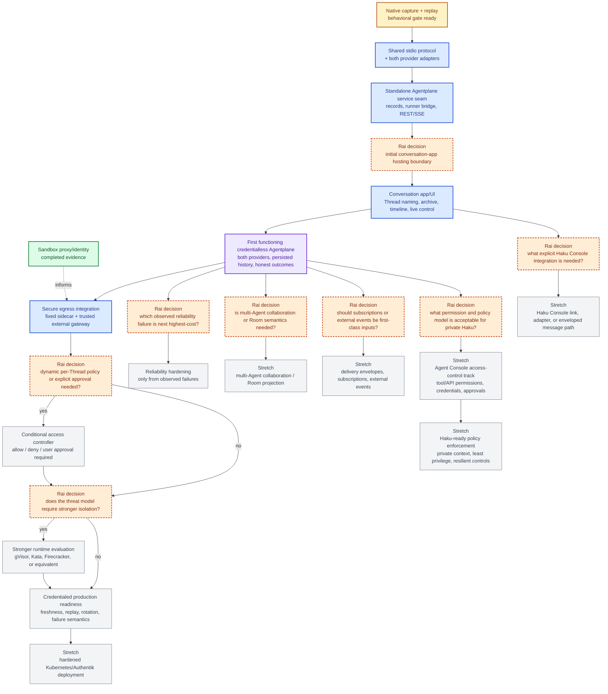

# Agentplane task DAG

This is the single project overview for Agentplane work. It is a dependency map, not a workflow
engine or a request to build every future subsystem. Boxes are sized as coherent agent work packages;
the detailed provider/scenario tasks remain in the supporting experiment documents.

## Outcome

Rai can use a separate conversation-style app backed by a standalone Agentplane service to create a
Thread, start one Claude or Codex runner, send an Input, watch native/model-backed response and tool
activity arrive, and see an honest terminal outcome. The first functioning product is credentialless;
real upstream credentials are a later gate.

## Current status

- **Sandbox proxy/identity evidence is complete:** the standalone spike proved proxy-only Secret
  delivery, Pod/Sandbox workload authentication, replay rejection, and the same-Pod route-confinement
  limitation. It informs later egress work but does not gate the native path.
- **Native capture + replay is integrated:** PR #15's implementation and fixtures are now present on
  the branch behind PR #5342. The replay gate now covers every checked-in compact upstream
  provider/scenario fixture with behavioral lifecycle assertions; its focused real-binary run remains
  the verification step. Complete native logs are regenerated by live capture when needed, not kept
  in Git.
- **Next:** give one agent end-to-end ownership of the shared stdio protocol and both provider adapters.
- **Access-control scope is intentionally deferred:** the current Ducktape work can use its existing
  broad internet boundary and scoped GitHub credential for `agentydragon-agent`; that convenience is
  not a policy model for the private, high-context Haku agent.

## DAG

Legend: green is completed evidence accepted as a separate spike; amber is integrated native-capture
work with bounded review gaps; blue is the next focused work; purple is the first
functioning-product milestone; orange diamonds are unresolved decisions requiring Rai's product or
design input; gray is conditional or stretch work.

The orange nodes are deliberately limited to choices that change downstream implementation ordering:
initial app hosting, dynamic policy/approval, stronger isolation, reliability priority, collaboration
semantics, external-event scope, Haku Console integration mode, and private-Haku permission policy. A
“no” choice should close or defer that branch rather than create speculative scaffolding.

The `P`/`K` path is only the narrow access decision needed for a credentialed Agentplane egress
deployment. It is not the general Agent Console permission model represented by `AA`/`AB`, and it must
not be reused as a private-Haku policy language by default. The existing broad Ducktape lane is a
scoped operational convenience, not evidence that the same grants are safe for an agent with Rai's
personal context.

## Work-package acceptance

- **Sandbox evidence:** the committed spike and evidence memo distinguish proven credential exclusion,
  Pod/Sandbox authentication, replay/lifecycle behavior, and unsupported same-Pod route confinement.
- **Native capture + replay:** real Claude and Codex binaries, live native/model captures, compact
  upstream replay fixtures, fake-model replay, steering/interrupt, idle resume, and upstream
  reconnect evidence. The detailed matrix is in [`experiments.md`](experiments.md) and the [capture
  harness README](../capture/README.md). Native logs are disposable and regenerated when needed.
- **Capture integration:** PR #15's implementation and compact replay fixtures are present on the
  branch behind PR #5342; preserve provider-specific behavior and unsupported results while closing
  the bounded review gaps in the [capture harness README](../capture/README.md). Harness upgrades or
  newly tested protocol areas require a fresh live capture, human inspection of differences, and
  targeted driver/test updates rather than committing verbose native logs.
- **Shared protocol + adapters:** one stdio contract justified by captured native frames, with both
  Claude and Codex adapters exercised through the same shared seam. This is one agent-owned package,
  not separate provider projects.
- **Standalone service seam:** Agentplane owns its service, API, persistence, runner bridge, and
  deployment boundary without importing Haku Console. The first service path starts a runner, accepts
  an Input, streams events, persists enough history for refresh, and reports failure honestly.
- **Conversation app/UI:** a small client uses the Agentplane API rather than calling provider code
  directly. It shows Thread history, assistant/tool activity, live updates, provisioning/running/
  failed/uncertain states, and refresh-safe completed responses. Generated names and archive
  presentation stay in this app layer.
- **First functioning Agentplane:** one standalone, credentialless end-to-end workflow works for both
  providers with real bridge activity, persisted history, live updates, and an honest terminal result.
- **Secure egress and credentialed readiness:** one narrow synthetic operation proves the fixed sidecar
  to trusted gateway path before any real upstream credential is enabled. Real credentials remain only
  at the gateway; durable freshness/replay, per-Sandbox/Thread binding, rotation, and escape tests gate
  production use.
- **Reliability:** choose one observed failure with the highest user cost after the first functioning
  product. Each hardening slice needs its own reproduction and acceptance test; do not implement every
  candidate in advance.
- **Stretch branches:** collaboration, external events, Haku Console integration, stronger runtimes,
  hardened deployment, and the private-Haku access-control track each begin only after the
  corresponding decision node and dependencies are resolved. The private-Haku track must cover tool
  execution, HTTP/API calls, credential handling, approvals, and policy behavior without assuming that
  routine per-action approval clicks are a reliable safety mechanism.

## Ownership and sequencing rules

- Kubernetes/Agent Sandbox owns Claim, Sandbox, Pod, PVC, readiness, suspension, and workload lifecycle.
- Native harnesses own native history, execution semantics, and provider-native resume.
- Agentplane owns its product records, runner bridge, API/service boundary, and live
  `Pod -> Sandbox -> Thread -> Agent` mapping once that mapping is required.
- The conversation app owns product UX such as generated Thread names, naming persistence, archive
  presentation, and timeline behavior. It may remain separate or later be hosted by Haku Console, but
  must not create shared runtime, route, frontend, or persistence coupling.
- Do not add a common protocol, persistence schema, UI projection, Kubernetes controller, credential
  path, or approval framework to unblock native capture or the shared adapter seam.
- Do not enable real upstream credentials until the secure-egress and credentialed-readiness gates pass.
- A single Thread and one active runner are acceptable for the first functioning product. Multi-Agent
  rooms, subscriptions, external events, advanced retention, and provider migration are not hidden
  prerequisites.

## Detailed plans

- Native provider scenarios, live-capture workflow, and compact replay evidence: [`experiments.md`](experiments.md)
  and the [capture harness README](../capture/README.md).
- Sandbox identity and egress evidence: [sandbox spike README](../sandbox-spike/README.md) and [egress
  ADR](adr_sandbox_proxy_gateway.md).
- Product/API layering and deferred capabilities: [`product_surface.md`](product_surface.md) and
  [`architecture.md`](architecture.md).
