# Agentplane P0 task DAG

This is a sequencing aid for the first native-harness slice, not a workflow engine or a second
architecture. A node is complete only when its evidence exists.

## Outcome

For Claude and Codex, a real harness can be launched, driven through its native protocol, observed
through its upstream model exchange, and run again from a deterministic replay with assertions for
native output, tool I/O, and workspace effects.

## Current status

- **S0 is complete:** the sandbox proxy and workload-identity spike has committed manifests and live
  evidence. It informs later credentialed egress work but does not gate the native capture path.
- **A–J are complete on capture branch PR #15:** both providers have native captures, replay tests,
  steering/interrupt evidence, idle resume evidence, and upstream disconnect/reconnect evidence. The
  capture branch still needs to be integrated into the branch behind PR #5342.
- **Next:** integrate the capture branch, then implement the thin shared stdio protocol and both
  provider adapters.

## DAG

```mermaid
flowchart LR
    classDef completed fill:#dcfce7,stroke:#15803d,color:#14532d,stroke-width:2px
    classDef captureComplete fill:#fef3c7,stroke:#b45309,color:#78350f,stroke-width:2px
    classDef next fill:#dbeafe,stroke:#1d4ed8,color:#1e3a8a,stroke-width:2px
    classDef deferred fill:#f3f4f6,stroke:#6b7280,color:#374151

    S0["S0<br/>Sandbox proxy/identity evidence"]:::completed

    subgraph P0["P0 native capture — evidence complete on PR #15"]
        direction LR
        A["A<br/>Experiment contract"]:::captureComplete --> B["B<br/>Process + transcript harness"]:::captureComplete
        B --> C["C<br/>Provider launch/handshake"]:::captureComplete
        C --> D["D<br/>Claude baseline/tool"]:::captureComplete
        C --> E["E<br/>Codex baseline/tool"]:::captureComplete
        D --> F["F<br/>Fake-model replay"]:::captureComplete
        E --> F
        F --> G["G<br/>Upstream disconnect/reconnect"]:::captureComplete
        G --> H["H<br/>Steering/interrupt"]:::captureComplete
        H --> I["I<br/>Idle native resume"]:::captureComplete
        I --> J["J<br/>Compact fixtures + Bazel replay"]:::captureComplete
    end

    J --> M["Integrate capture branch<br/>into PR #5342"]:::next
    M --> K["K<br/>Thin shared stdio protocol<br/>+ Claude/Codex adapters"]:::next
    K --> L["L<br/>Small standalone Agentplane<br/>API/service slice"]:::deferred

    S0 -. informs later egress .-> L

```

Legend: green is completed evidence already accepted as a separate spike; amber is completed native
capture work that is still awaiting integration into PR #5342; blue is the next focused work; gray is
downstream or deferred work.
See [S0 sandbox proxy and identity evidence](../sandbox-spike/README.md).

A and B are support. C through I are behavior. J is only the minimum regression packaging for the
behavior already proven.

## Gates

- Do not start F until at least one real baseline/tool path works for each provider.
- Do not add a shared provider abstraction before D and E expose an actual common behavior.
- Do not add persistence, common timeline, Kubernetes lifecycle, or recovery machinery to unblock a
  node in this DAG.
- If a node fails because the provider lacks a capability, record the provider-specific result and
  continue; do not expand the framework to make the matrix look complete.
- If the implementation has more artifact bookkeeping than native-driving logic, stop and cut it.

## Evidence by node

- **A:** documented command and endpoint assumptions; no credentials committed.
- **B:** one test proving partial pipe reads and complete ordered payload capture.
- **C:** actual initialize/handshake exchange for each provider.
- **D/E:** real baseline/tool transcript plus hand-authored expected behavior.
- **F:** real Claude/Codex binaries driven against a deterministic fake upstream; captured model
  requests and native output both asserted.
- **G:** one controlled upstream stream loss after partial response; exact chunks before loss,
  subsequent connection/request behavior, native output, process survival, duplicate suppression or
  duplication, and terminal outcome. Explicit no-retry/unsupported is valid evidence.
- **H:** actual steering/interrupt request and resulting native evidence, or explicit unsupported.
- **I:** native session/thread continuity after idle child restart, or explicit unsupported.
- **J:** offline replay passes with no network, credentials, Kubernetes, hashes, lengths, manifests,
  or custom promotion/scanner system.

## Deferred branch

Only after I, and only if a concrete product need remains, investigate:

- multiple pending inputs and dequeue;
- active-turn process death and side-effect reconciliation;
- central/bridge reconnect;
- Pod replacement and Sandbox suspension;
- PostgreSQL Thread/Input/Turn persistence;
- a neutral bridge protocol and UI projection; and
- authentication, fencing, approvals, credential delivery, subscriptions, and external-event
  adapters.
