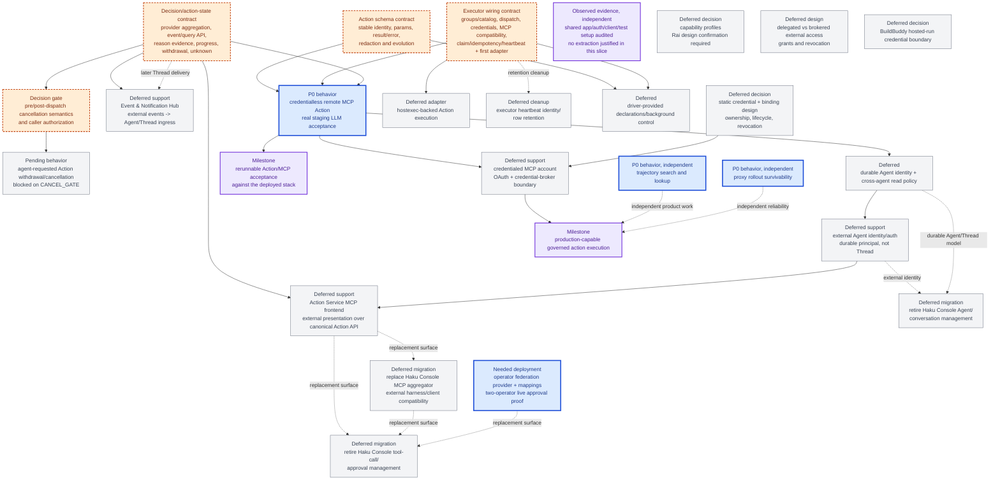

# Agentplane task DAG

This is the authoritative project overview for Agentplane. It records landed behavior as evidence and
keeps only work with a current user-visible outcome or a named design gate in the active path. Edges
are real dependencies; packages without an edge may proceed independently. Labels mean:

- **P0 behavior**: the next user-visible behavior;
- **needed support**: implementation needed to prove that behavior;
- **observed evidence**: already landed or measured; and
- **deferred**: deliberately outside the current slice.

## Current truth on `devel`

**Observed evidence — workload authentication and LLM ingress landed.** PR
[#5685](https://github.com/agentydragon/ducktape/pull/5685) added the generic
`authenticatedWorkloadToken` credential source. PR
[#5696](https://github.com/agentydragon/ducktape/pull/5696) added the shared immutable
`SandboxPrincipal` resolver. PR [#5698](https://github.com/agentydragon/ducktape/pull/5698) added and
wired the independently deployable authenticated LLM ingress. Staging runners present only the
`agentplane-credential-agentplane-workload` placeholder; central egress substitutes the authenticated
Pod-bound bearer for the selected destination, which resolves the live Sandbox and forwards
provider-native traffic to LiteLLM with a server-held virtual key. The compatibility audience is
still `agentplane-egress`; `agentplane-workload` remains a possible coordinated rename, not missing
P0 behavior. See [`../docs/workload_authentication.md`](../docs/workload_authentication.md).

**Observed evidence — the standalone Action Service landed.** PR
[#5700](https://github.com/agentydragon/ducktape/pull/5700) made the service the PostgreSQL owner of
`ActionRequest`, `Decision`, `Execution`, state events, and a pending-decision outbox reference. The
current caller envelope accepts exactly a 1–200 character `idempotency_key`, a structured
`action` object with separate `group` and `name` fields, a JSON-object `arguments`, and optional JSON-object `origin`/`correlation`; extra
top-level fields are rejected, and origin/correlation are untrusted provenance. Workload callers can read their own redacted records; the operator surface can read all
and issue an expected-version, idempotent human allow/deny Decision. Allow auto-dispatches exactly
one Execution; there are no blind retries, and an ambiguous outcome becomes `execution_unknown`
through the bounded lease/recovery contract in [`../docs/executor_liveness.md`](../docs/executor_liveness.md).

The canonical service now composes reviewed MCP groups through `McpActionGroupExecutor`,
with stdio and credentialless streamable HTTP, initial discovery, schema rechecks, and
lifecycle-owned cleanup. Real MCP fixtures exercise dispatch; isolated counting/failure
executors remain for concurrency and recovery tests. There is no dedicated Echo executor.

**Needed support — deployed operator connection and MCP0 acceptance.** The app's review
UI/BFF uses canonical models and the existing operator client; production review is
unavailable until a supported app-to-service operator auth boundary is configured.
Implementation in [PR #5820](https://github.com/agentydragon/ducktape/pull/5820) adds PostgreSQL
sessions, exact operator arguments, and request-bound federation with destination subject authorization.
The provider is not deployed; see [operator federation](../docs/operator_federation.md). Workload identities
must never acquire operator authority. Live Agent acceptance is implemented in `//x/agentplane/acceptance:test_mcp`, using
real harnesses and the reviewed upstream Everything image. It requires the integrated
images/manifests to be rolled out; see `../acceptance/README.md`.

**Observed evidence — launch presets landed.** PR
[#5648](https://github.com/agentydragon/ducktape/pull/5648) landed the app-owned `SandboxPreset` and
`ThreadPreset` first slice, including `public-coder`, runner initialization, UI selection, and the
manual live acceptance target. Broader capability profiles remain deferred; see
[`../docs/launch_presets.md`](../docs/launch_presets.md) and [`profiles.md`](profiles.md).

**Observed evidence — executor liveness and orphan-recovery contract landed for the in-process
fixture executor.** Executor-level health heartbeats, a per-Execution lease/heartbeat with bounded
expiry, `lease_expired`/`executor_lost` reason attribution, and authenticated late-completion or
authoritative-status reconciliation restricted to an Execution already `execution_unknown` resolve
`EW` item 6 and part of item 5. Dispatch is still in-process; items 2–4 and 7 remain open, while the
MCP adapter portion of item 9 is landed in #5753 and its production composition/remote acceptance
remain open; see
[`../docs/executor_liveness.md`](../docs/executor_liveness.md).

**Observed evidence — egress rules API boundary landed.** PR
[#5701](https://github.com/agentydragon/ducktape/pull/5701) made
`http://agentplane-egress.agentplane-staging.svc.cluster.local/v1/rules` an ordinary destination:
normal policy and exact workload-placeholder substitution, then independent destination bearer
validation through `SandboxPrincipalAuthenticator`. Service port 80 targets a separate API listener
in the same process/Pod; port 8888 remains the forward proxy. `RulesProjection` shares the enforcement
index and the redacted response contract. No local-dispatch branch or new credential mode is needed.

## DAG

The first executable Action/MCP path is `AS + EW + DEL -> MCP0 -> MCPACCEPT`. It uses a
credentialless, staging-owned deterministic streamable-HTTP MCP fixture and a real Claude/Codex
acceptance turn; it does not wait for GitHub OAuth. The later credentialed path is `MCP0 -> MCPAUTH ->
PROD`. The shared setup audit (`DEDUPE`) found no extraction justified in this slice; see
[the audit](../../../debug/agentplane_shared_setup_audit.md). Trajectory search and proxy survivability
can proceed without waiting for those gates. None of these independent tracks proves production
Action execution.

The external-surface and migration tracks are intentionally separate from `MCP0`: `DEL` plus an
authenticated durable external Agent identity (`EID`) are prerequisites for `MCPFRONT`, the Action
Service MCP frontend. It supplies the replacement surface for `MCPAGG` and `RETIRE_TOOLS`, while the
integration-app approval UI consumes the same Action-state/Decision surface. Hostexec is another
Executor adapter behind `EW`; its final ordering relative to the credentialed MCP path is deferred.
Haku Console migration is split: Agent/conversation management and tool-call/approval management
can retire on different schedules after their respective replacement surfaces exist. Neither is a
prerequisite for the first Action/MCP acceptance.

## Named gates and acceptance evidence

### `AS` — Action schema contract

**P0 behavior:** a caller can submit one stable, reviewable, namespaced Action whose parameters are
validated before a Decision or dispatch, and whose result/error can be safely replayed.

**Needed support / decisions:**

1. Define **Action** as the code-owned capability concept and **ActionRequest** as one immutable
   invocation of that Action. Keep the existing request lifecycle and one-logical-intent model.
2. Choose a stable group/action name and catalog evolution behavior. No public `action_version` is
   required; execution re-checks the current executor/tool schema and refuses incompatible arguments.
3. Define parameter representation and validation. **Recommendation:** use the live MCP/tool schema
   for the first adapter; introduce a smaller typed contract only if a non-MCP executor needs it.
4. Define the result and stable error envelope, including which backend/provider details are safe to
   persist and return.
5. Define redaction and projection rules for inputs, results, errors, Decision views, events, logs,
   and replay fixtures. Do not add a generic `sensitivity` field to every Action.
6. Keep ActionGroup-to-executor and MCP-server/tool bindings in reviewed runtime configuration such
   as YAML, so backend/account changes do not require an image roll.

**Acceptance evidence for the first slice:** connect a small credentialless remote MCP fixture,
mirror its catalog, auto-allow one deterministic read-only Action, and prove with the deployed live
acceptance suite that a real Claude/Codex Agent can invoke it and receive a safe result. Include
negative tests for unknown group/action, malformed parameters, incompatible current tool schema,
malformed result/error, and sensitive data appearing in any projection or log. GitHub account access
is a separate later credentialed milestone below.

### `EW` — Executor wiring contract

**P0 behavior:** one accepted and allowed ActionRequest selects exactly one healthy configured
Executor, crosses a defined credential boundary, and produces one durable result or explicit unknown
outcome without replay.

**Needed support / decisions:**

1. Define how stable group/action identity selects an Executor and how capability/definition
   registration is validated at startup. Duplicate, missing, or incompatible registrations fail
   startup or request admission; they do not fall through at dispatch time.
2. Define adapter/backend configuration and validation, including what is static code/config and what
   may be changed without rebuilding.
3. Choose in-process execution versus a separate worker/process for the first adapter, and record the
   failure/isolation property that justifies the choice. **Recommendation:** use an in-process,
   code-owned adapter only if its SDK/transport can uphold the credential and no-retry boundary;
   otherwise choose a separate worker before adding a generic worker framework.
4. Define the credential and Kubernetes ServiceAccount boundary. State which process may receive a
   real credential, how central egress or native workload identity is used, and what the Action
   Service itself must never possess.
5. Define dispatch transport and result/event delivery back to the Action Service, including how a
   worker proves which request it is completing. **Landed in part:** the lease-token bearer a
   worker presents to heartbeat or complete is decided (`docs/executor_liveness.md`); the transport
   that would carry it out of process is not.
6. **Landed:** preserve the exactly-one claim — one Execution row, atomic claim before dispatch, no
   retry after dispatch may have begun, bounded lease expiry to `execution_unknown` on ambiguous
   loss, and adapter-agnostic reconciliation (late completion or an authoritative status lookup)
   restricted to an Execution already `execution_unknown`, never preempting a live attempt. See
   `docs/executor_liveness.md`.
7. Define idempotency-key behavior at request admission and at the backend boundary. A backend key
   may reduce duplicate effects but does not weaken the service's no-retry rule.
8. Define executor health and capability discovery as startup/readiness evidence, not a broad dynamic
   registry. **Landed in part:** an executor-level health heartbeat exists internally and feeds
   orphan-reason attribution; no external readiness/discovery endpoint exists yet.
9. **Landed in part by PR #5753:** `McpActionGroupExecutor` is a tested in-process adapter for one
   configured stdio MCP server. It mirrors `tools/list`, refreshes on notification or interval,
   rechecks the live tool schema before dispatch, initiates `tools/call`, and maps safe success,
   tool-error, and ambiguous transport outcomes. This does not yet wire the adapter into the
   production composition or provide a remote streamable-HTTP transport.
10. Wire the MCP adapter into the Action Service composition and reviewed runtime configuration,
    then select the credentialless remote MCP fixture and write the deployed acceptance test before
    calling `EW` complete. The fixture must expose one deterministic read-only tool and require no
    OAuth or provider credential.
11. Minimum evidence for that fixture: the named Action validates, allow auto-dispatches once, the
    MCP server receives the exact intended `tools/call`, duplicate Decision/start paths do not call it
    twice, success and safe failure are delivered, and ambiguous transport loss becomes unknown
    without retry. The test must live in `x/agentplane/acceptance/` and run against staging with a
    real LLM Agent, not remain a manual one-off.

An injected test executor cannot satisfy the live acceptance gate.

### `MCP0` — credentialless remote MCP vertical slice

**P0 behavior:** a real staging Claude/Codex Agent discovers one configured ActionGroup, submits one
read-only ActionRequest, and polls durable Action events to a safe result produced by a remote MCP
server without the Agent or Action Service holding a provider credential.

**Needed support:** production composition for the landed MCP executor, a staging-owned deterministic
streamable-HTTP MCP fixture (or a deliberate transport extension from the current stdio adapter),
reviewed runtime binding, a narrow auto-allow policy for the fixture Action, and an acceptance
scenario in `x/agentplane/acceptance/test_action_mcp.py`.
Use real MCP tools for successful-execution fixtures; keep isolated failure/counting doubles
only where the test needs deterministic failure or concurrency control.

**Acceptance evidence:** `//x/agentplane/acceptance:all` runs the scenario against the deployed
stack for both real harness providers, verifies catalog discovery, exactly one Action execution,
cursor-based event polling, and the exact safe tool result. It must not assert success from the
Agent's prose alone.

### `MCPAUTH` — credentialed MCP account and OAuth boundary

**Deferred support:** connect a user's GitHub MCP account without moving browser OAuth state or
refresh credentials into the harness. Haku Console or a shared credential broker should own the
operator identity, authorization-code + PKCE flow, callback state, token exchange/refresh, and
durable token association. Action Service should receive only an opaque account/credential binding
and own MCP discovery/call translation. If standalone operation later requires Action Service to own
OAuth, implement the smallest separately tested subset rather than copying Haku Console wholesale.
The static credential and binding model is a separate design decision below and requires Rai's
confirmation before implementation begins.

**Acceptance evidence:** a separate credentialed live scenario proves account linkage, catalog
refresh, one safe GitHub read, token refresh/reconnect, and negative isolation for an unbound or
different account. This milestone must not block `MCP0` or be folded into the credentialless fixture
test.

### `EID` — external Agent identity and authentication

**Deferred support:** authenticate external Agent clients, including Claude Code Web or another
non-Agentplane-hosted harness, as a known durable Agent identity distinct from any Thread or
Sandbox. The identity must be trusted by Agentplane before an external MCP client can use
`MCPFRONT` or receive approval state. This requirement does not select a static credential scheme.
Username, Thread ID, and caller-supplied provenance are not identity authority.

**Acceptance evidence:** an external client authenticates as one configured Agent, cannot impersonate
another configured Agent, and remains distinct from the originating Thread/Sandbox model used by
hosted Agentplane workloads.

### `CRED` — static credential and binding design

**Deferred decision — Rai confirmation required:** define what a static credential is bound to
(Agent, external account, MCP server, or another authority), which component owns issuance and
storage, how expiry/refresh/revocation works, how a binding is selected at execution time, and what
the Agent/API may observe. This node is a design discussion, not an implementation task; do not
start code or schema work from it until Rai confirms the design.

### `PROFILES` — cross-cutting capability profiles

**Deferred decision — Rai confirmation required:** define a durable authority for capabilities shared by egress, approvals, MCP
reachability, and other tool permissions. Do not widen the landed launch-preset slice or store this
profile in Kubernetes merely to reserve the concept; the profile owner, inheritance, and policy
read/verification boundary remain open. Do not start implementation before the design is confirmed.

**Acceptance evidence:** one profile can be resolved consistently by each participating authority,
with explicit precedence and negative tests for stale, cross-Agent, or caller-supplied profile names.

### `ACCESS` — delegated versus brokered external access

**Deferred design:** choose per-system whether an Action uses the Agent's delegated identity, a
brokered operator credential, or a hybrid. Keep target-side RBAC and egress enforcement authoritative;
use grants/revocation reconciliation where a broker mints delegated authority. This is the broader
external-access policy behind `MCPAUTH` and `HOSTEXEC`, not a prerequisite for `MCP0`.

**Acceptance evidence:** a selected system proves the credential boundary, approval behavior, and
revocation/expiry semantics without putting a reusable privileged credential in the harness.

### `MCPFRONT` — Action Service MCP frontend

**Deferred support — smallest user-visible behavior:** an authenticated external MCP client discovers
Actions, submits one ActionRequest without waiting for approval, and reads its pending Decision and
eventual safe result. This is external MCP presentation over the canonical Action API, not another
executor, remote MCP runtime, or lifecycle store.

**Dependencies:** `DEL` for the canonical Decision/Action-state and durable event-query contract,
and `EID` for trusted durable external Agent identity. Caller-supplied Agent/Thread names and
origin/correlation are not identity authority. `MCPFRONT` is not a prerequisite for `MCP0`.
This planning change implements neither the frontend nor identity, OAuth, cancellation, Event Hub,
profiles, or remote MCP runtime; the external authentication mechanism remains an `EID` decision.

**Needed support / contract:**

- **Catalog:** present the canonical ActionGroup/Action catalog and input schemas; preserve separate
  group/name identity and never expose executor bindings or credentials. Do not create an MCP-owned
  registry or dispatch directly to an upstream tool.
- **Submit:** forward the canonical ActionRequest envelope and caller-scoped idempotency key under
  the authenticated external Agent principal. Return the durable request ID and current state,
  including `decision_pending`, rather than holding an MCP call open for human approval.
- **Get / events:** read only that caller's canonical request and ordered durable Action events.
  `after_sequence` is the last event sequence already received; return later events in order, use
  the last returned sequence for the next poll, and return an empty list when none are newer.
  Reconnect/restart resumes from the same request ID and cursor, without another submission or
  execution. Do not add a frontend-owned cursor, queue, or event log.
- **Approvals:** canonical DecisionProviders and the existing operator UI/BFF remain the decision
  path, including expected-version/idempotent allow/deny. MCP clients cannot acquire operator
  authority or bypass the canonical single-Execution/no-blind-retry lifecycle.
- **Isolation / projection:** preserve caller-own reads and canonical redaction of arguments,
  results, errors, and events. The human `decision_note` remains shared unchanged with caller and
  operator, not a private channel; non-human `reason_code`/`reason_description` remain separate.

**Acceptance evidence:** a real external MCP client, authenticated as Agent A, discovers a configured
Action, submits it, observes pending state, and resumes event polling after reconnect and service
restart. Allow through the canonical operator BFF produces exactly one Execution and the same safe
result as the Action API; deny produces none. Replay duplicate submission/Decision delivery and
prove Agent B cannot get or poll A's request, forged provenance cannot change ownership, and no
operator-only arguments, credential-bearing bindings, or unsafe executor payloads leak through MCP.
This integration proof comes before any frontend-specific persistence or framework.

### `MCPAGG` — Haku Console MCP aggregator replacement

**Deferred migration:** use `MCPFRONT` as the replacement external MCP presentation surface for Haku
Console's aggregator. Verify the required external harness/client workflows against it before
retiring the old surface; do not build a second frontend, approval coordinator, or authority store.
The exact transport, MCP tool projection, and migration order remain open. Tool-call/approval
management retirement remains the separate `RETIRE_TOOLS` milestone.

### `HOSTEXEC` — hostexec-backed Action execution

**Deferred support:** add hostexec as an Action Service Executor adapter, preserving hostexec's
existing machine/user authorization, credential exchange, process-state, output, and no-retry
boundaries. This is an adapter behind `EW`, not a reason to build a generic worker framework first.

**Acceptance evidence:** one approved host command produces one durable Execution with bounded output
and safe terminal/unknown handling; duplicate starts do not run the command twice, and the Action
Service never receives a reusable host credential.

### `LIVE_CLEAN` — executor heartbeat retention cleanup

**Deferred cleanup:** executor liveness currently creates one heartbeat identity row per coordinator
process lifetime. Once deployment scale makes that accumulation meaningful, choose a stable executor
identity or bounded expiry/compaction policy and add retention tests; do not change the exactly-one
claim or unknown-outcome semantics while doing so.

### `APPROVALUI` — deploy the integration-app operator approval path

**Needed support:** configure the Action-only Authentik federation target, reviewed source/target
subject mappings and allowlists, and network reachability. The UI and BFF already use the canonical
Action API; #5820 adds durable browser sessions and request-bound federation. Do not build another
approval coordinator or make human push notifications a prerequisite for this polling UI.

**Acceptance evidence:** validate real provider claims with two operators and a denied operator,
then prove one browser approval reaches the canonical Decision and executes MCP once. Signed mock
integration is implementation evidence, not proof of deployed Authentik policy. Keep federation
explicitly disabled until this gate is met.

### `RETIRE_AGENT` — Haku Console Agent/conversation management migration

**Deferred migration:** retire Haku Console's own Agent and conversation management only after
Agentplane has the external identity, durable Agent/Thread lifecycle, conversation read/control, and
replacement runtime surfaces required by Haku. This is a migration and decommissioning milestone,
not a prerequisite for Action execution; preserve explicit read/export and rollback evidence before
removing the old owner.

### `RETIRE_TOOLS` — Haku Console tool-call and approval management migration

**Deferred migration:** retire Haku Console's connected-MCP catalog, tool-call application/approval
queue, and related tool-call management only after `MCPFRONT`, the `MCPAGG` compatibility migration,
integration-app approval UI, credential bindings, and canonical Action/Decision APIs cover the
required workflows.
This track may move independently of Agent/conversation management: Haku Console may continue to own
conversations while Agentplane owns external tool calls, or the reverse during a staged migration.
Preserve tool-call audit/export and rollback evidence before removing the old owner.

### `DEL` — decision and Action-state contract

**P0 behavior:** submission remains non-blocking; the Action API and durable Action events expose a pending
human Decision and the eventual Decision/Execution result with bounded provider-authored reason
evidence. Originating-Agent/Thread notification is a later integration node, not a prerequisite for
proving that an Agent can use an Action backed by MCP.

**Observed evidence — synchronous DecisionProvider aggregation landed.** PR
[#5732](https://github.com/agentydragon/ducktape/pull/5732) added deny-dominant aggregation of
configured synchronous non-human providers ahead of the existing human path, with bounded
provider-authored reason evidence and a shared optimistic-version/idempotency commit path for both
human and auto-provider Decisions. See [`async_approvals.md`](async_approvals.md).

**Needed support:** human decision callbacks, withdrawal/cancellation through `CANCEL_GATE` below, bounded progress, redacted
payload projection, and what an Agent receives for `execution_unknown`. Durable Action event
append/query with cursor-based (`after_sequence`) polling is landed; see `action_service/README.md`.
A separate outbox is not required for this slice, and the never-drained `action_outbox` table has
been dropped.

**Acceptance evidence:** a scripted replay covering submit -> pending -> allow/deny -> one execution
or no execution -> Action API polling, including process restart and duplicate callback delivery.
Landed: restart-surviving event sequence, cursor/pagination polling, and redaction of
credential-shaped arguments/results/errors and unsafe exceptions while surfacing the unchanged
human `decision_note`, bounded non-human provider reason evidence, and safe terminal result.
Open: human-provider notification and withdrawal evidence.

### `CANCEL_GATE` → `CANCEL` — agent-requested withdrawal/cancellation

**Pending P0 behavior, explicitly blocked:** let the requesting agent ask the canonical Action
Service to withdraw/cancel its own Action. Do not implement an endpoint until pre-dispatch versus
post-dispatch semantics and authorization are defined. Decide ownership, permissible states,
expected-version/idempotency behavior, races with allow/claim/start, and whether a running executor
supports cancellation versus only a stop request with unknown outcome. A pre-dispatch withdrawal
must prove no Execution can subsequently start; a post-dispatch response must not falsely promise
that external side effects were undone. This gate owns the Action/API/event/schema implications.

**Acceptance evidence after the gate:** replay caller-own versus other-agent/forged requests and
withdraw-versus-dispatch races, including restart and duplicate delivery. No implementation in #5820.

### Decision note — existing query/BFF projection

**Landed behavior:** one bounded human-authored `decision_note` is stored and returned unchanged to
requesting caller and operator through the existing Action API polling/BFF. The migration preserves
existing notes; there is no private human-note field. Non-human provider `reason_code` and
`reason_description` remain separate bounded outcome evidence. API/BFF tests cover exact note
visibility and duplicate/stale decisions; push notification and offline Thread wake remain in `ING`.

### `ING` — Event & Notification Hub

**Deferred support:** consume Action events and external sources such as GitHub/Calendar, match
user/Agent subscriptions, and deliver structured events into an Agent/Thread ingress. The Hub owns
subscription matching, deduplication, batching/debounce, rate limits, backpressure, offline delivery,
and Thread wake/queue semantics. It is not an executor or an Action decision authority.

## Preserved decisions

These are observed product decisions and must not be reopened by the schema or wiring gates:

- `ActionRequest` is one logical intent with an invariant request shape.
- `Decision` and `Execution` are separate durable records.
- One ActionRequest may create at most one Execution.
- A final allow Decision may auto-dispatch; there is no universal agent `commit` step.
- The v0 DecisionProvider is human/operator-backed.
- Dispatch is never blindly retried; ambiguity becomes `execution_unknown`.
- Caller-own and operator-all reads remain the v0 access scope. Operator arguments are exact; caller arguments and executor results/errors retain recursive credential-shaped redaction.

## Deferred

- capability matrices or a broad Agent identity/privilege framework;
- cross-cutting capability profiles — see [`profiles.md`](profiles.md);
- delegated-versus-brokered external-access policy and grant/revocation semantics — see
  [`external_access.md`](external_access.md);
- MCP registry, dynamic action marketplace, standing grants, and cross-agent permissions;
- production executor implementation in this planning PR;
- per-destination workload audiences until recipient isolation is required;
- broad profiles beyond the landed launch-preset slice; and
- cryptographic Decision signing until Decisions cross a boundary that requires it.
