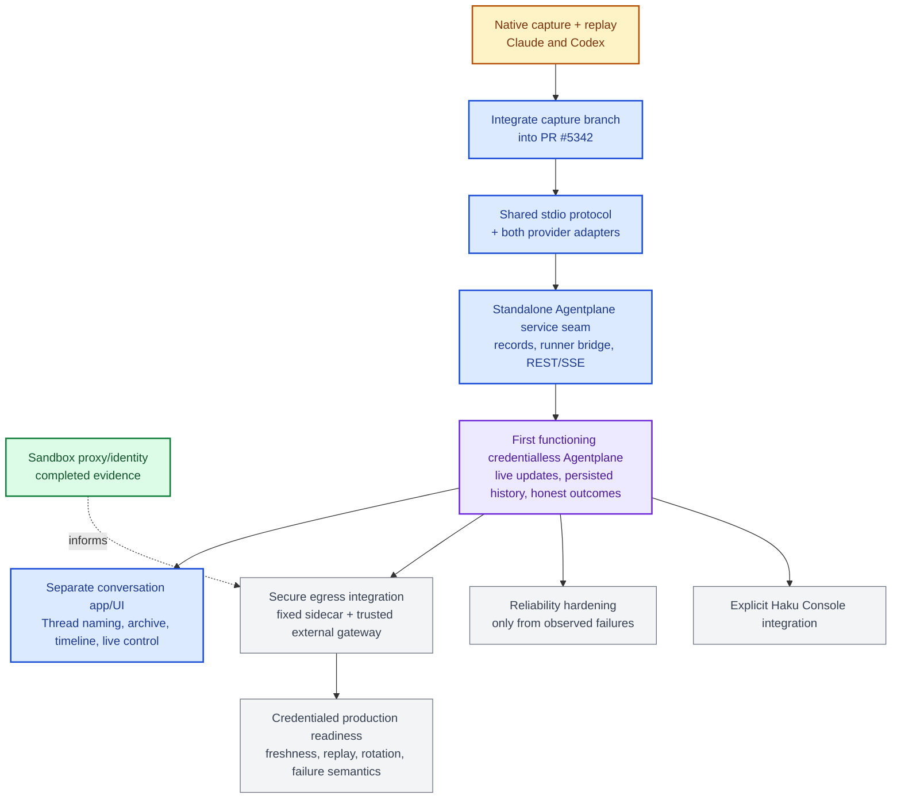

# Agentplane P0 task DAG

This is a sequencing aid for the first native-harness slice, not a workflow engine or a second
architecture. A node is complete only when its evidence exists.

## Outcome

For Claude and Codex, a real harness can be launched, driven through its native protocol, observed
through its upstream model exchange, and run again from a deterministic replay with assertions for
native output, tool I/O, and workspace effects.

## Current status

- **S0 is complete:** the sandbox proxy and workload-identity spike has committed manifests and live
  evidence. It informs later credentialed egress work but does not gate the native capture path.
- **Native capture is complete on PR #15:** one agent delivered the Claude and Codex captures, replay
  tests, steering/interrupt evidence, idle resume evidence, and upstream disconnect/reconnect evidence.
  The capture branch still needs to be integrated into the branch behind PR #5342.
- **Next:** integrate the capture branch, then implement the thin shared stdio protocol and both
  provider adapters.

## DAG

Legend: green is completed evidence already accepted as a separate spike; amber is completed native
capture work that is still awaiting integration into PR #5342; blue is the next focused work; purple is
the first functioning-product milestone; gray is downstream or deferred work.
See [S0 sandbox proxy and identity evidence](../sandbox-spike/README.md).

This overview intentionally uses one box for the native capture package and one box for the shared
protocol/adapters. The detailed provider/scenario matrix and acceptance evidence remain in
[`experiments.md`](experiments.md) and the [capture task packet](subtasks/capture_native_harness_wires.md).

## Gates

- Do not start F until at least one real baseline/tool path works for each provider.
- Do not add a shared provider abstraction before D and E expose an actual common behavior.
- Do not add persistence, common timeline, Kubernetes lifecycle, or recovery machinery to unblock a
  node in this DAG.
- If a node fails because the provider lacks a capability, record the provider-specific result and
  continue; do not expand the framework to make the matrix look complete.
- If the implementation has more artifact bookkeeping than native-driving logic, stop and cut it.

## Evidence by node

- **S0:** live sandbox/proxy evidence, including the proven credential boundary and the unsupported
  same-Pod route-confinement result.
- **Native capture + replay:** real Claude and Codex launch, baseline/tool driving, steering/interrupt,
  idle resume, upstream reconnect behavior, exact transcripts, and replay tests.
- **Integrate capture branch:** PR #15's captured implementation is present on the branch behind PR
  #5342, with its original provider-specific evidence intact.
- **Shared protocol + adapters:** one stdio contract whose commands/events are justified by captured
  native frames, exercised through both real providers.
- **Standalone service seam:** the smallest API/service path that starts a runner, accepts an Input,
  streams events, persists enough history for refresh, and reports an honest terminal outcome.
- **First functioning Agentplane:** end-to-end credentialless operation through the standalone service
  and separate conversation app.
- **Deferred branches:** secure egress, credentialed readiness, reliability hardening, and explicit
  Haku Console integration each require their own observed evidence and acceptance test.

## Deferred branch

Only after I, and only if a concrete product need remains, investigate:

- multiple pending inputs and dequeue;
- active-turn process death and side-effect reconciliation;
- central/bridge reconnect;
- Pod replacement and Sandbox suspension;
- PostgreSQL Thread/Input/Turn persistence;
- a neutral bridge protocol and UI projection; and
- authentication, fencing, approvals, credential delivery, subscriptions, and external-event
  adapters.
